# 1. compileflow是什么

compileflow是一个轻量、高效、可集成、可扩展的开源流程引擎。目前开源的Process引擎是淘宝工作流TBBPM引擎之一，是专注于纯内存执行，无状态的流程引擎，通过将流程文件转换生成java代码编译执行，简洁高效。该引擎非常轻量易使用，更因为预编译内存对象使得流程处理更加高效。compileflow引擎无需实例化，适用于内存不间断处理的流程任务。

compileflow能让开发人员通过流程编辑器设计自己的业务流程，将复杂的业务逻辑可视化，丰富的compileflow流程节点和属性配置几乎能代替所有代码实现。compileflow和其他流程引擎一样给业务设计人员与开发工程师架起了一座桥梁。高一致性的模型和流程概念减小了设计与开发的“代沟”，它既是产品经理想要的流程设计，也是开发人员需要的可执行程序。

# 2. compileflow引擎核心
#### 2.1	流程上下文
 本节讲述流程上下文的概念及定义，上下文是流程流转的过程和结果对象，了解上下文的定义对于配置comileflow流程非常重要。

流程上下文分为执行流程文件需要传入的变量，流程运行中的内部变量和需要返回的变量。在编辑器的属性类型中分别对应param，inner，return。

缺省值补充：在定义上下文变量中缺省值defaultValue支持宏变量，如$arrayList表示pList的初始值为new ArrayList()；除$arrayList外还有$now，$hashSet对应new Date()和new HashSet()。缺省值也支持自己定义，以@开头即可，如$arrayList也可以填@new java.util.Date()。

#### 2.2	节点变量
 comfileflow流程由不同的节点和连接线构成，节点是执行服务的单元，在之前定义的流程上下文就可以用于填充节点的入参和出参。

例如我们需要执行一个计算费用的服务节点，该节点需要的入参和出参可从流程上下文中的变量（contextVarName）获得。无需流程上下文的变量，也可直接填入缺省值（defaultValue）。此处表示计算费用的服务入参为流程上下文中的pList的长度，计算的结果赋值到流程上下文中的变量totalPrice。

#### 2.3	节点定义


##### 2.3.1	开始节点
 ``` xml
表示流程的开始，一个流程有且只有一个开始节点，它没有传入连接，只有一个传出连接，流程启动时从这个节点开始。它包含以下属性：
Id：唯一标识号
Name：节点的显示名称
```
##### 2.3.2	结束节点

 ``` xml
表示流程的结束，一个流程有且只有一个结束节点，它没有传出连接，只有一个传入连接，流程启动后执行到这个节点结束。它包含以下属性：
Id：唯一标识号
Name：节点的显示名称
```
##### 2.3.3	自动节点

 ``` xml
表示流程中应执行的任务单元，该节点可有多个传入连接，只有一个传出连接，流程执行到该节点将执行节点配置的任务。任务支持springbean和java配置类型，它包含以下属性：
Id：唯一标识号
Name：节点的显示名称
Type：任务执行类型（springbean，java）
Classtype：接口或实现类
Method：方法
节点变量
```
##### 2.3.4	脚本节点

 ``` xml
表示流程中脚本任务执行单元，该节点可有多个传入连接，只有一个传出连接。流程执行到该节点将执行节点配置的脚本语言，现支持MVEL和QL两种脚本语言。它包含以下属性：
Id：唯一标识号
Name：节点的显示名称
Type：脚本语言类型（MVEL，QL）
Expression：脚本内容
节点变量
```
	 
##### 2.3.5	判断节点

 ``` xml
表示流程中需要逻辑判断决定走向的节点，该节点可有多个传入和多个传出连线。节点通过传出连线的表达式和优先级配置选择哪一个传出线，判断节点可配置任务（选配）。它包含以下属性：
Id：唯一标识号
Name：节点的显示名称
Type：任务执行类型（springbean，java）
Classtype：接口或实现类
Method：方法
节点变量
传出连接线属性：
Name：连接线的显示名称
Expression：判断表达式
Priority：判断条件优先级
```

##### 2.3.6	循环节点

 ``` xml
表示流程中需要遍历集合对象执行的节点，可有多个传入和一个传出连线。该节点内可拖入其他流程节点，也可嵌套循环节点。循环节点对集合变量支持for和while两种循环方式执行节点内的流程节点。它包含以下属性：
Id：唯一标识号
Name：节点的显示名称
loopType：循环类型（for，while）
whileExpression：循环表达式（循环类型为while时）
collectionVarName：循环的集合变量名
variableName：循环过程中的变量名
indexVarName：循环游标变量名
```

##### 2.3.7	子流程节点

 ``` xml
表示流程过程中调用另一个流程，子流程节点可有多个传入连接和一个传出连接。现支持调用process和workflow两种子流程。它包含以下属性：
Id：唯一标识号
Name：节点的显示名称
subBpmCode：子流程code
type：调用子流程的引擎类型（process，workflow）
waitForCompletion：是否等待子流程完成
变量定义
```

##### 2.3.8	continue节点

 ``` xml
表示循环节点中特定条件下继续循环，用于循环节点中，可有多个传入连接，一个传出连接。它包含以下属性：
Id：唯一标识号
Name：节点的显示名称
Expression：继续循环的条件表达式
```
##### 2.3.9	break节点

 ``` xml
表示循环节点中特定条件下跳出循环，用于循环节点中，可有多个传入连接，一个传出连接。它包含以下属性：
Id：唯一标识号
Name：节点的显示名称
Expression：跳出循环的条件表达式
```

##### 2.3.10	注释节点

 ``` xml
用于解释流程节点的含义，不作为流程的运行节点，仅用于注释显示。没有传入连接，只有一个传出连接。它包含以下属性：
Id：唯一标识号
Name：节点的显示名称
Comment：注释内容
Visable：展示或隐藏
```


# 3. Design intention

1. 希望为业务开发提供端至端，从设计至实现的业务流程解决方案。
2. 提供多种流程引擎，实现从战略至商业能力，商业能力至业务流程，业务流程至系统，并最终实现业务的可视化全局架构。
3. 设计高效的执行引擎，实现对服务的快速组合或扩展，提升研发效率至极致。

# 4. Features
1. 高性能：通过将流程文件转换生成java代码编译执行，简洁高效。
2. 丰富的应用场景：在阿里巴巴中台解决方案中广泛使用，支撑了导购、交易、履约、资金等多个业务场景。
3. 可集成：轻量、简洁的设计使得可以极其方便地集成到各个解决方案和业务场景中。
4. 完善的插件支持：流程设计目前有Idea、Eclipse插件支持，可以在流程设计中实时动态生成JAVA代码并预览，所见即所得。
5. 支持流程设计图生成svg文件和单元测试代码。

# 5. Quick start

### Step1: 下载安装Idea插件

插件下载地址：https://github.com/alibaba/compileflow-idea-designer

*安装说明：请使用Idea本地安装方法进行安装，重新启动Idea IDE就会生效。*

### Step2: 引入POM文件

```
<dependency>
    <groupId>com.alibaba.compileflow</groupId>
    <artifactId>compileflow</artifactId>
    <version>1.0.0</version>
</dependency>

```

注意: compileflow仅支持JDK1.8及以上版本。

### Step3: 流程设计
下面以ktv demo 为例，通过demo的演示和实践了解节点及属性的配置和API的使用。
demo描述：N个人去ktv唱歌，每人唱首歌，ktv消费原价为30元/人，如果总价超过300打九折，小于300按原价付款

#### S3.1
创建bpm文件，如下图：


*注：bpm文件路径要和code保持一致，在文件加载模式下流程引擎执行时会根据code找到文件*

#### S3.2
增加流程全局属性定义，如下图：
基本属性：
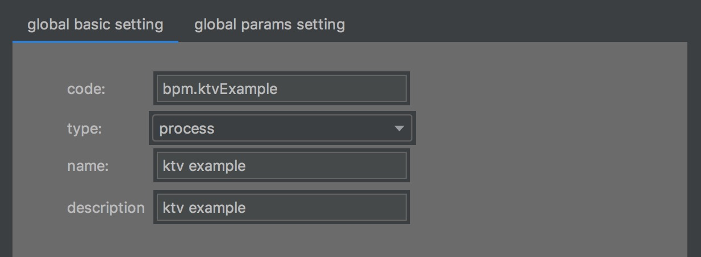
变量设置：
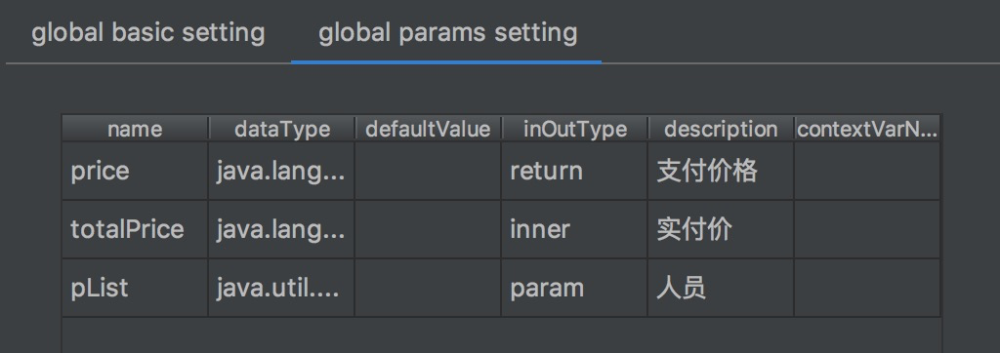
第一行表示，price会放入返回的结果Map中
第二行表示，totalPrice作为流程的全局变量，用于流程中需要的中间变量
第三行表示，参数Map中的变量pList作为流程全局变量


#### S3.3 拖拽图形组建画出如下流程图：
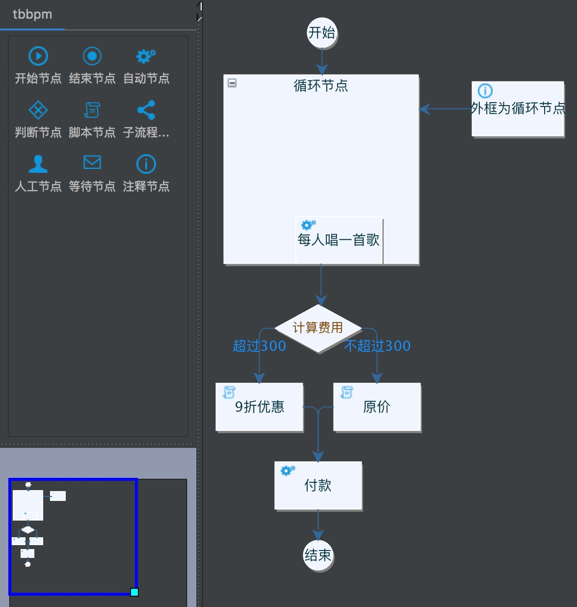

#### S3.4
编写供流程调用的代码:
Spring bean为spring中配置bean的java类，Java class为原生java类

唱歌：
  - 类：MockSpringBean（spring bean: springService）
  - 方法：
```java
public void sing(String name) {
    System.out.println(name + " issinging");
}
```

计算费用：
- 类：MockJavaClazz（java class）
- 方法：
```java
public int calPrice(int num) {
    System.out.println("totalprice: " + 30 * num);
    return 30 * num;
}
```
付款：

- 类：MockSpringBean（spring bean: springService）
- 方法：
```java
public void payMoney(int price) {
    System.out.println("actuallypaid money: " + price);
}
```

#### S3.5 配置节点属性
开始节点和结束节点无需设置。
每个节点中的基本属性填写名称（此处略）

- 循环节点
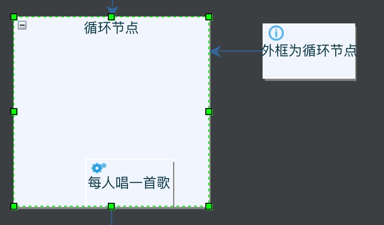
  - 属性设置：
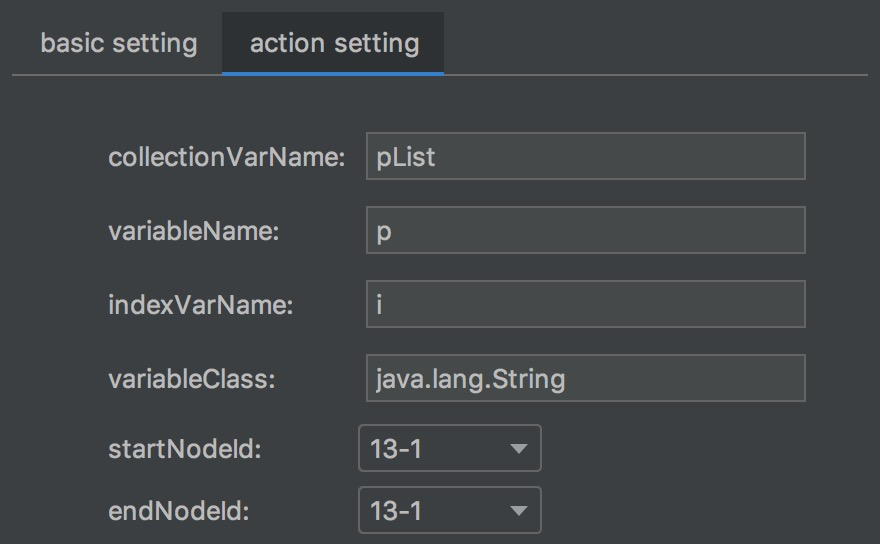

- 自动节点

  - 属性设置：
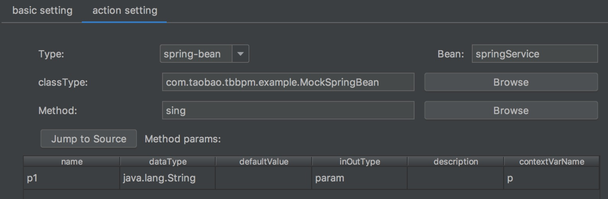

- 自动节点
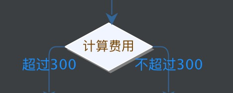
  - 属性设置：
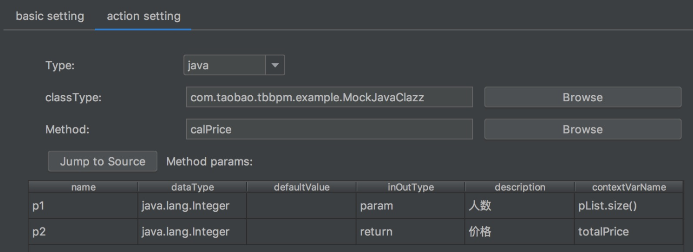
  - Decision指向路径
  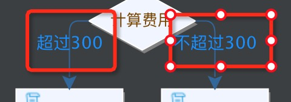
      - 左侧路径：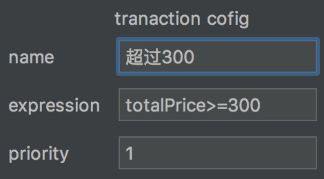
      - 右侧路径：

- 脚本节点

  - 属性设置：


- 脚本节点
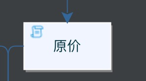
  - 属性设置：
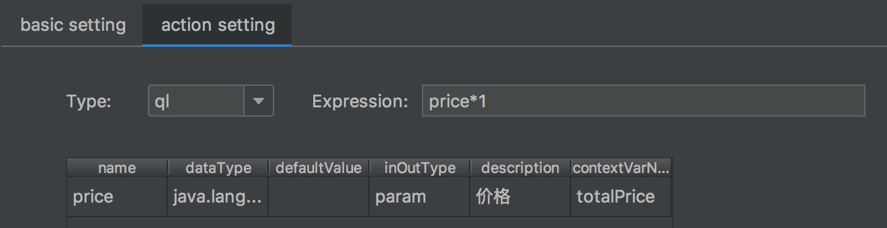

- 自动节点
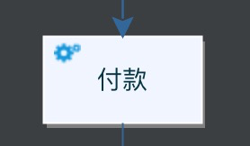
  - 属性设置：
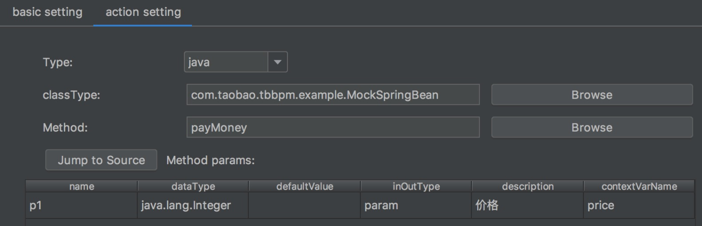

至此流程图就画好了，胜利曙光就在前方。
重新打开流程图，点开java代码预览，可以看到生成的java代码。
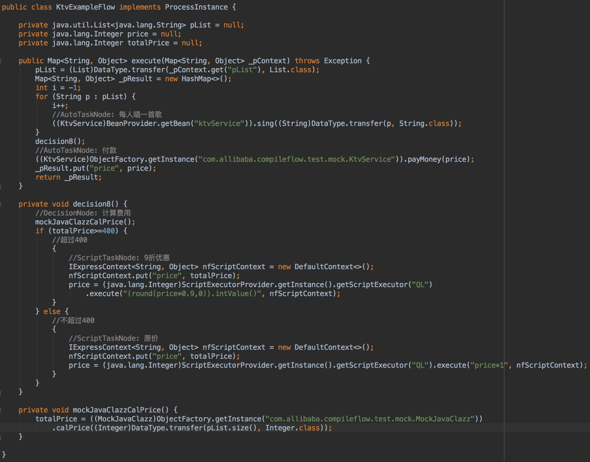

#### S3.6 调用流程
编写如下单元测试：
```java
@Test
    public void test_ktvProcess() throws Exception {
       String code = "com.taobao.tbbpm.process.ktvExample";
       IBpmDefine define = BpmDefineFactory.loadBpmDefine(code);
       ProcessEngine engine = ProcessEngineFactory.getProcessEngine();
       engine.preCompile(code);
       Map<String, Object> context = new HashMap<String,Object>();
       List<String> pList = new ArrayList<String>();
       pList.add("wuxiang");
       pList.add("junyu");
       pList.add("xuannan");
       pList.add("babo");
       pList.add("fasheng");
       pList.add("zuozhu");
       pList.add("dongkuang");
       pList.add("kongxuan");
       pList.add("zongwu");
       pList.add("yunshu");
       pList.add("jishao");
       context.put("pList", pList);
       System.out.println("processreturn value price： "
              + engine.start(code, context).get("price"));
       //generate SVG file
       String svg = GraphFactory.toSvg(define, null);
       FileWriter svgFile = new FileWriter("d:/bpmsvg.svg");
       svgFile.write(svg);
       svgFile.flush();
    }
```    

***compileflow原生只支持淘宝BPM规范，为兼容BPMN2.0规范，做了一定适配，但仅支持部分 BPMN2.0元素，如需其他元素支持，可在原来基础上扩展。***

# 欢迎加入compileflow开发群

1. 请钉钉联系 @余苏 @徐工 @梵度 @哲良 @无相
