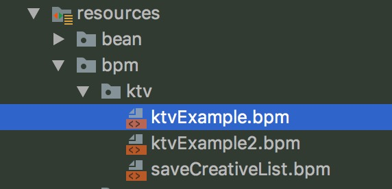

📖 See the [📖 中文文档](README_CN.md) for document in Chinese. 

# 1. compileflow

Compileflow is a very lightweight, high-performance, integrable and extensible process engine.

The Compileflow process engine is an important part of Taobao Business Process Management(TBBPM), which is dedicated to optimizating operations at Alibaba’s Taobao Marketplace. Specifically, Compileflow is designed to focus on pure memory execution and stateless process engines by converting process files to generate, compile and execute java code.

Currently, compileflow powers multiple core systems such as Alibaba's e-commerce stores and transactions.


Compileflow allows developers to design their own business processes through the process editor, which will visualize complex business logic, and build a bridge between designers and development engineers.

# 2. Design Intention
1.Provide an end-to-end business process solution from design to execution of business development ideas.

2.Offer a variety of process engines to realize the visual global architecture, so that strategy easily translates to visualizations, which lead to enhanced business capabilities, processes and system.

3.Design an efficient execution engine that can support the company's rapid deployment of new services, and capable of streamlining processes that accelerate the development response and interaction speed.

# 3. Features
1.High performance: It is simple and efficient for compiling and executing java code, which is generated by converting process files.

2.Diverse application scenarios: Widely used across Alibaba's mid-platform solutions; supports multiple business scenarios such as shopping guides, transactions.

3.Integrable: Lightweight and concise design makes it extremely easy to integrate into various solutions and business scenarios.

4.Complete plugin support: Compileflow is currently supported by IntelliJ IDEA and Eclipse plugins. Java code can be dynamically generated and previewed in real-time during the process design. What you see is what you get.

5.Process design drawing:Supports exporting to SVG file and unit test code. 

# 4. Quick Start
## Step1: Download and install IntelliJ IDEA plugin (optional)
Plugin download address: https://github.com/alibaba/compileflow-idea-designer
Installation instructions: Please use IntelliJ IDEA local installation method to install. Then restart IntelliJ IDEA to activate.
## Step2: Import POM file
Note: Compileflow only supports JDK 1.8 and above.
## Step3: Process design
Refer to the KTV demo below to understand the configuration of nodes and attributes and the use of APIs through the demonstration and practice of the demo.

Demo description: N number of people go to ktv to sing. Each person sing a song. The usual fee for the ktv seesion is 30 yuan/person, but if the total price exceeds 300 yuan, they would receive 10% off. But if the groups's total fee falls under 300 yuan, they need to pay the full price.

### S3.1
Create a bpm file, as shown below:



Note: The path of the bpm file must be consistent with the code. When the process engine executes in the file loading mode, the file will be found according to the code.
### S3.2
Design process through plug-ins or write process xml files directly.

### S3.3 invoke process
Write the following unit test:
```java
public void testProcessEngine() {
    final String code = "bpm.ktv.ktvExample";

    final Map<String, Object> context = new HashMap<>();
    final List<String> pList = new ArrayList<>();
    pList.add("wuxiang");
    pList.add("xuan");
    pList.add("yusu");
    context.put("pList", pList);

    final ProcessEngine<TbbpmModel> processEngine = ProcessEngineFactory.getProcessEngine();

    final TbbpmModel tbbpmModel = processEngine.load(code);
    final OutputStream outputStream = TbbpmModelConverter.getInstance().convertToStream(tbbpmModel);
    System.out.println(outputStream);
    System.out.println(processEngine.getTestCode(code));

    processEngine.preCompile(code);

    System.out.println(processEngine.start(code, context));
}
```

Compileflow was designed to support the Taobao BPM specification. It has made adaptations to be compatible with the BPMN 2.0 specification, but only supports some of BPMN 2.0 elements. If other elements are needed, it can be extended on the original basis.

# 5. More information
[DEMO quick start](https://github.com/alibaba/compileflow/wiki/%E5%BF%AB%E9%80%9F%E5%BC%80%E5%A7%8BDEMO)

[Detailed description of the original Taobao BPM specification](https://github.com/alibaba/compileflow/wiki/%E5%8D%8F%E8%AE%AE%E8%AF%A6%E8%A7%A3)

# 6. Welcome to join the compileflow development group
Please contact @余苏 @徐工 @梵度 @哲良 @无相


### Known Users
Welcome to register the company name in this issue: https://github.com/alibaba/compileflow/issues/9


