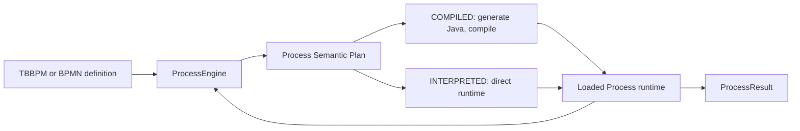

<div align="center">
  

# CompileFlow

**An embeddable compile-then-execute process engine for Java**

[](https://github.com/alibaba/compileflow/actions/workflows/workbench-server-ci.yml)
[](https://github.com/alibaba/compileflow/actions/workflows/java-core-ci.yml)
[](https://github.com/alibaba/compileflow/actions/workflows/workbench-ci.yml)
[](https://scorecard.dev/viewer/?uri=github.com/alibaba/compileflow)
[](docs/compatibility-policy.md)
[](https://www.apache.org/licenses/LICENSE-2.0.html)

[](https://github.com/alibaba/compileflow/stargazers)
[](https://github.com/alibaba/compileflow/fork)

[中文文档](docs/zh/README.md)

</div>

CompileFlow is an embeddable Java process engine. It reads the documented TBBPM and BPMN subsets, validates them, and
executes a shared process model. The default `COMPILED` mode generates and reuses Java runtimes; `INTERPRETED` executes
the same model without generated process classes. ProcessEngine execution is in-process and without persisted continuation. The optional
Durable product adds persisted waits, timers, effects, and crash recovery.

> **Status:** the default branch targets the unreleased `2.0.0` line and uses `2.0.0-SNAPSHOT` coordinates. Durable is a
> Developer Preview. See [Supported Surfaces](docs/architecture/06-SUPPORTED_SURFACES.en.md) for current product
> boundaries and [Compatibility Policy](docs/compatibility-policy.md) for versioning commitments.

## Choose a product surface

| Need                                                               | Use                                                                      |
|--------------------------------------------------------------------|--------------------------------------------------------------------------|
| In-process, low-latency execution                                  | `ProcessEngine` with `compileflow-tbbpm` or `compileflow-bpmn`           |
| Persisted waits, timers, governed side effects, and crash recovery | [CompileFlow Durable](compileflow-durable/README.md) (Developer Preview) |
| Browser modeling, release management, and execution inspection     | [CompileFlow Workbench](compileflow-workbench/README.md)                 |

These surfaces are independent. Adding Workbench or Durable does not make ordinary `ProcessEngine.execute(...)` calls
persistent.

## Core API

| Type                | Purpose                                                                            |
|---------------------|------------------------------------------------------------------------------------|
| `ProcessEngine`     | Thread-safe execution engine bound to one model format and immutable configuration |
| `ProcessRef`        | Reference to an exact published version or a managed Alias                         |
| `ProcessDefinition` | Explicit inline or classpath process content                                       |
| `ProcessResult<T>`  | Typed success or failure with stable error information                             |

Keep one long-lived `ProcessEngine` for each distinct model type and configuration. Close it with the application
lifecycle; do not create an engine per request.

## Quick start

CompileFlow requires JDK 17 or newer. Published bytecode targets Java 17. CI runs the complete behavioral suite on Java
17 and focused concurrency and dynamic-code compatibility checks on Java 21 and 25.

Install the current snapshot from source:

```bash
./mvnw install -pl compileflow-spring-boot-starter -am -DskipTests
```

Add the Spring Boot starter:

```xml
<dependency>
    <groupId>com.alibaba.compileflow</groupId>
    <artifactId>compileflow-spring-boot-starter</artifactId>
    <version>2.0.0-SNAPSHOT</version>
</dependency>
```

Inject the application-scoped engine and execute an explicit definition:

```java
@Service
public class OrderService {

    private final ProcessEngine processEngine;

    public OrderService(ProcessEngine processEngine) {
        this.processEngine = processEngine;
    }

    public OrderResult execute(OrderRequest request) {
        ProcessDefinition definition = ProcessDefinition.classpath(
                "order.process",
                "flows/order-process.bpm");

        return processEngine.execute(
                        definition,
                        request,
                        OrderResult.class,
                        ProcessExecutionOptions.defaults())
                .orElseThrow();
    }
}
```

For a complete project, run
[`examples/spring-boot-basic`](examples/spring-boot-basic/README.md). The
[quick-start guide](docs/en/quick-start.md) also covers standalone composition, preflight, warm-up, and shutdown.
For a production-shaped HTTP scenario with gateways, a process call, parallel work, iteration, retries, and controlled
errors, run [`examples/spring-boot-order-fulfillment`](examples/spring-boot-order-fulfillment/README.md).

## Execution model


```mermaid
flowchart LR
    definition["TBBPM or BPMN definition"]
    engine["ProcessEngine"]
    semantic["Process Semantic Plan"]
    compile["COMPILED: generate Java, compile"]
    interpret["INTERPRETED: direct runtime"]
    runtime["Loaded Process runtime"]
    result["ProcessResult"]

    definition --> engine --> semantic
    semantic --> compile --> runtime
    semantic --> interpret --> runtime
    runtime --> result
    runtime --> engine
```

CompileFlow uses explicit source identity, immutable deployment versions, bounded extension points, and typed errors.
The executable node subsets and public compatibility promises are listed in
[Supported Surfaces](docs/architecture/06-SUPPORTED_SURFACES.en.md).

## Documentation

| Goal                              | English                                                             | 中文                                                        |
|-----------------------------------|---------------------------------------------------------------------|-------------------------------------------------------------|
| Start using the engine            | [Quick Start](docs/en/quick-start.md)                               | [快速开始](docs/zh/quick-start.md)                          |
| Configure and size an application | [Configuration](docs/en/configuration.md)                           | [配置指南](docs/zh/configuration.md)                        |
| Use persisted execution           | [Durable Process](docs/en/durable-process.md)                       | [Durable Process](docs/zh/durable-process.md)               |
| Understand the architecture       | [Architecture](docs/architecture/README.md)                         | [架构文档](docs/architecture/README.md)                     |
| Check supported contracts         | [Supported Surfaces](docs/architecture/06-SUPPORTED_SURFACES.en.md) | [支持面清单](docs/architecture/06-SUPPORTED_SURFACES.zh.md) |
| Operate a deployment              | [Operations](docs/en/operations-playbook.md)                        | [运维手册](docs/zh/operations-playbook.md)                  |
| Contribute                        | [Contributing](CONTRIBUTING.md)                                     | [Contributing](CONTRIBUTING.md)                             |

The [documentation center](docs/README.md) is the canonical index for task guides, specifications, architecture, and
module documentation. Use [Supported Surfaces](docs/architecture/06-SUPPORTED_SURFACES.en.md) for compatibility
decisions.

## Build and test

Run the embedded-engine integration suite:

```bash
./mvnw -B test -pl compileflow-integration-tests -am
```

Repository-specific verification commands are documented in the [testing guide](docs/en/testing.md). Release
requirements are enforced by the repository workflows and the checks listed in [CONTRIBUTING.md](CONTRIBUTING.md).

## Community

- [Support policy](SUPPORT.md)
- [Contributing](CONTRIBUTING.md)
- [Maintainers](MAINTAINERS.md)
- [Issue tracker](https://github.com/alibaba/compileflow/issues)
- [Security policy](SECURITY.md)

## License

CompileFlow is available under the [Apache License 2.0](LICENSE).
