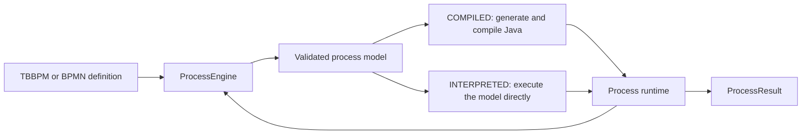

<div align="center">
  

# CompileFlow

**A high-performance process engine for Java**

[](https://github.com/alibaba/compileflow/actions/workflows/workbench-server-ci.yml)
[](https://github.com/alibaba/compileflow/actions/workflows/java-core-ci.yml)
[](https://github.com/alibaba/compileflow/actions/workflows/workbench-ci.yml)
[](https://scorecard.dev/viewer/?uri=github.com/alibaba/compileflow)
[](docs/en/compatibility-policy.md)
[](https://www.apache.org/licenses/LICENSE-2.0.html)

[](https://github.com/alibaba/compileflow)
[](https://github.com/alibaba/compileflow/fork)

[中文 README](README_CN.md)

</div>

CompileFlow is a lightweight, high-performance, embeddable, and extensible process engine for Java. It supports TBBPM
and the documented subset of BPMN 2.0.

The CompileFlow Process engine focuses on in-memory, stateless execution. CompileFlow is used by core systems across
Alibaba business platforms, including Taobao, Alibaba Cloud, and international businesses.

CompileFlow Durable persists long-running process state so execution can resume after waits, timers, external
operations, or an application restart.

The visual editor turns complex business logic into workflows that business and engineering teams can understand and
maintain together. Java Actions connect application services, rules, and Agent calls in the same process. CompileFlow
Deploy and Durable add versioned rollout and persistent execution.

## Key capabilities

- **⚡ High-performance execution** — Choose compiled or interpreted execution; compiled mode generates and reuses Java
  runtimes.
- **🧩 TBBPM and BPMN** — Use one engine API and runtime model for TBBPM and the documented subset of BPMN 2.0.
- **✅ Java and Spring Boot integration** — Embed a thread-safe engine directly or through Spring Boot, with declared variables,
  preflight validation, typed results, and stable errors.
- **🚦 Versioned deployment** — Publish immutable versions, update aliases with revision checks, and route deterministic
  canary traffic with CompileFlow Deploy.
- **⏱️ Durable execution** — Persist waits, timers, and external-operation state, then resume execution after an
  application restart.
- **🖥️ Visual Workbench** — Model and validate processes in the browser, then publish, monitor, and inspect execution
  through the Workbench Server.
- **🤖 Agent workflow orchestration** — Compose Agent calls with service actions and business rules through Java Actions.

## Choose a product surface

| Need                                                               | Use                                                            |
| ------------------------------------------------------------------ | -------------------------------------------------------------- |
| In-process, low-latency execution                                  | `ProcessEngine` with `compileflow-tbbpm` or `compileflow-bpmn` |
| Immutable versions, aliases, and canary rollout                    | [CompileFlow Deploy](compileflow-deploy/README.md)             |
| Persisted waits, timers, external operations, and restart recovery | [CompileFlow Durable](compileflow-durable/README.md)           |
| Browser modeling, release management, and execution inspection     | [CompileFlow Workbench](compileflow-workbench/README.md)       |

These surfaces are independent. Adding Deploy, Durable, or Workbench does not make `ProcessEngine.execute(...)` calls
persistent; persistent execution uses the Durable API.

## Core API

| Type                | Purpose                                                  |
| ------------------- | -------------------------------------------------------- |
| `ProcessEngine`     | Thread-safe process execution entry point                |
| `ProcessRef`        | Reference to a published version or alias                |
| `ProcessDefinition` | Process definition supplied inline or from the classpath |
| `ProcessResult<T>`  | Typed result or failure with stable error information    |

Keep one long-lived `ProcessEngine` for each distinct configuration. A single engine discovers every installed
frontend, while each definition carries its model type. Close the engine with the application lifecycle; do not
create an engine per request.

## Quick start

CompileFlow supports JDK 17, 21, and 25. Generated bytecode targets Java 17.

Build and install the required modules from source:

```bash
./mvnw install -pl compileflow-spring-boot-starter-tbbpm -am -DskipTests
```

Add the Spring Boot starter:

```xml
<dependency>
    <groupId>com.alibaba.compileflow</groupId>
    <artifactId>compileflow-spring-boot-starter-tbbpm</artifactId>
    <version>2.0.0-SNAPSHOT</version>
</dependency>
```

Inject the application-scoped engine and execute an explicit definition:

```java
@Service
public class OrderService {

    private final ProcessEngine processEngine;

    public OrderService(ProcessEngine processEngine) {
        this.processEngine = processEngine;
    }

    public OrderResult execute(OrderRequest request) {
        ProcessDefinition definition = ProcessDefinition.classpath(
                ProcessModelType.TBBPM, "order.process",
                "flows/order-process.bpm");

        return processEngine.execute(
                        definition,
                        request,
                        OrderResult.class,
                        ProcessExecutionOptions.defaults())
                .orElseThrow();
    }
}
```

For a complete project, run
[`examples/spring-boot-basic`](examples/spring-boot-basic/README.md). The
[quick-start guide](docs/en/quick-start.md) also covers standalone composition, preflight, warm-up, and shutdown.
For a fuller HTTP example with gateways, a process call, parallel work, iteration, retries, and controlled errors, run
[`examples/spring-boot-order-fulfillment`](examples/spring-boot-order-fulfillment/README.md).

## Execution model


```mermaid
flowchart LR
    definition["TBBPM or BPMN definition"]
    engine["ProcessEngine"]
    semantic["Validated process model"]
    compile["COMPILED: generate and compile Java"]
    interpret["INTERPRETED: execute the model directly"]
    runtime["Process runtime"]
    result["ProcessResult"]

    definition --> engine --> semantic
    semantic --> compile --> runtime
    semantic --> interpret --> runtime
    runtime --> result
    runtime --> engine
```

See [Supported Surfaces](docs/en/architecture/supported-surfaces.md) for executable nodes, process formats, and public
compatibility commitments.

## Documentation

| Goal                              | English                                                          | 中文                                                     |
| --------------------------------- | ---------------------------------------------------------------- | -------------------------------------------------------- |
| Start using the engine            | [Quick Start](docs/en/quick-start.md)                            | [快速开始](docs/zh/quick-start.md)                       |
| Configure and size an application | [Configuration](docs/en/configuration.md)                        | [配置指南](docs/zh/configuration.md)                     |
| Use persisted execution           | [Durable Process](docs/en/durable-process.md)                    | [Durable Process](docs/zh/durable-process.md)            |
| Understand the architecture       | [Architecture](docs/en/architecture/README.md)                   | [架构文档](docs/zh/architecture/README.md)               |
| Check supported surfaces          | [Supported Surfaces](docs/en/architecture/supported-surfaces.md) | [支持面清单](docs/zh/architecture/supported-surfaces.md) |
| Operate a deployment              | [Operations](docs/en/operations-playbook.md)                     | [运维手册](docs/zh/operations-playbook.md)               |
| Contribute                        | [Contributing](CONTRIBUTING.md)                                  | [贡献指南（英文）](CONTRIBUTING.md)                      |

The [documentation center](docs/README.md) is the canonical index for task guides, specifications, architecture, and
module documentation. Use [Supported Surfaces](docs/en/architecture/supported-surfaces.md) for compatibility
decisions.

## Build and test

Run the embedded-engine integration suite:

```bash
./mvnw -B test -pl compileflow-integration-tests -am
```

Repository-specific verification commands are documented in the [testing guide](docs/en/testing.md) and
[CONTRIBUTING.md](CONTRIBUTING.md).

## Adopters

<table>
  <tr>
    <td align="center" width="20%"><br /><sub>Alibaba Group</sub></td>
    <td align="center" width="20%"><br /><sub>Taobao</sub></td>
    <td align="center" width="20%"><br /><sub>Tmall</sub></td>
    <td align="center" width="20%"><br /><sub>Alipay</sub></td>
    <td align="center" width="20%"><br /><sub>Cainiao</sub></td>
  </tr>
  <tr>
    <td align="center" width="20%"><br /><sub>Alibaba Cloud</sub></td>
    <td align="center" width="20%"><br /><sub>AliExpress</sub></td>
    <td align="center" width="20%"><br /><sub>Lazada</sub></td>
    <td align="center" width="20%"><br /><sub>Fliggy</sub></td>
    <td align="center" width="20%"><sub>…</sub></td>
  </tr>
</table>

## Community

- [Support policy](SUPPORT.md)
- [Contributing](CONTRIBUTING.md)
- [Maintainers](MAINTAINERS.md)
- [Issue tracker](https://github.com/alibaba/compileflow/issues)
- [Security policy](SECURITY.md)

## License

CompileFlow is available under the [Apache License 2.0](LICENSE).
