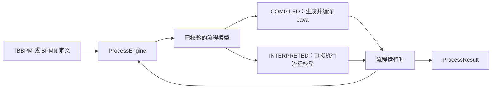

<div align="center">
  

# CompileFlow

**面向 Java 的高性能流程引擎**

[](https://github.com/alibaba/compileflow/actions/workflows/workbench-server-ci.yml)
[](https://github.com/alibaba/compileflow/actions/workflows/java-core-ci.yml)
[](https://github.com/alibaba/compileflow/actions/workflows/workbench-ci.yml)
[](https://scorecard.dev/viewer/?uri=github.com/alibaba/compileflow)
[](docs/zh/compatibility-policy.md)
[](https://www.apache.org/licenses/LICENSE-2.0.html)

[](https://github.com/alibaba/compileflow)
[](https://github.com/alibaba/compileflow/fork)

[English README](README.md)

</div>

CompileFlow 是一款轻量、高性能、可集成、可扩展的 Java 流程引擎，支持 TBBPM 和文档明确支持的 BPMN 2.0 子集。

CompileFlow Process 引擎专注于纯内存、无状态执行，已应用于阿里业务中台、淘宝、阿里云、国际化等业务的多个核心系统。

CompileFlow Durable 为长时间运行的流程提供持久化能力，可在流程等待、定时触发或外部操作后继续执行，并支持应用重启后的恢复。

可视化编辑器将复杂的业务逻辑呈现为清晰的流程图，便于业务与研发共同理解和维护。Java Action 将业务服务、规则和 Agent 调用
编排到同一流程中；CompileFlow Deploy 和 Durable 分别提供版本化发布与持久化执行。

## 核心能力

- **⚡ 高性能执行** —— 支持编译执行和解释执行两种模式；编译模式生成并复用 Java 运行时。
- **🧩 TBBPM 与 BPMN** —— 使用统一的引擎 API 处理 TBBPM 和文档明确支持的 BPMN 2.0 子集。
- **✅ Java 与 Spring Boot 集成** —— 可直接嵌入或通过 Spring Boot 集成，提供声明式变量、流程预检、类型安全的结果和稳定错误码。
- **🚦 版本化部署** —— 使用 CompileFlow Deploy 发布不可变版本，通过修订号检查更新别名，并按稳定规则进行灰度路由。
- **⏱️ 持久化执行** —— 保存流程等待、定时任务和外部操作状态，并在应用重启后恢复执行。
- **🖥️ 可视化 Workbench** —— 在浏览器中建模和校验流程，并通过 Workbench Server 发布、监控和查看执行。
- **🤖 Agent 工作流编排** —— 通过 Java Action 将 Agent 调用、服务操作和业务规则编排到同一流程中。

## 按需选择

| 需求                             | 使用                                                            |
| -------------------------------- | --------------------------------------------------------------- |
| 进程内低延迟执行                 | `ProcessEngine`，配合 `compileflow-tbbpm` 或 `compileflow-bpmn` |
| 不可变版本、别名和灰度发布       | [CompileFlow Deploy](compileflow-deploy/README.md)              |
| 跨应用重启保存流程状态并恢复执行 | [CompileFlow Durable](compileflow-durable/README.md)            |
| 可视化建模、发布管理和执行记录   | [CompileFlow Workbench](compileflow-workbench/README.md)        |

这些功能彼此独立。引入 Deploy、Durable 或 Workbench 不会改变 `ProcessEngine.execute(...)` 的进程内执行方式；持久化执行使用
Durable API。

## 核心 API

| 类型                | 用途                                       |
| ------------------- | ------------------------------------------ |
| `ProcessEngine`     | 线程安全的流程执行入口                     |
| `ProcessRef`        | 指向已发布版本或别名                       |
| `ProcessDefinition` | 通过内嵌内容或类路径提供流程定义           |
| `ProcessResult<T>`  | 返回类型安全的结果或带稳定错误码的失败信息 |

通常每种配置只需创建一个长生命周期的 `ProcessEngine`。同一个引擎可以执行所有已安装的流程格式，每个流程定义明确指定自身格式。
应用关闭时再关闭引擎，不要为每个请求重复创建。

## 快速开始

CompileFlow 支持 JDK 17、21 和 25，生成的字节码以 Java 17 为目标。

从源码构建并安装所需模块：

```bash
./mvnw install -pl compileflow-spring-boot-starter-tbbpm -am -DskipTests
```

添加 Spring Boot Starter 依赖：

```xml
<dependency>
    <groupId>com.alibaba.compileflow</groupId>
    <artifactId>compileflow-spring-boot-starter-tbbpm</artifactId>
    <version>2.0.0-SNAPSHOT</version>
</dependency>
```

注入应用级 `ProcessEngine` 并执行流程：

```java
@Service
public class OrderService {

    private final ProcessEngine processEngine;

    public OrderService(ProcessEngine processEngine) {
        this.processEngine = processEngine;
    }

    public OrderResult execute(OrderRequest request) {
        ProcessDefinition definition = ProcessDefinition.classpath(
                ProcessModelType.TBBPM, "order.process",
                "flows/order-process.bpm");

        return processEngine.execute(
                        definition,
                        request,
                        OrderResult.class,
                        ProcessExecutionOptions.defaults())
                .orElseThrow();
    }
}
```

完整项目示例见 [`examples/spring-boot-basic`](examples/spring-boot-basic/README.md)。[快速开始指南](docs/zh/quick-start.md)还介绍独立使用、流程预检、预热和关闭。
包含网关、流程调用、并行处理、迭代、重试和受控错误的 HTTP 场景见
[`examples/spring-boot-order-fulfillment`](examples/spring-boot-order-fulfillment/README.md)。

## 执行模型



可执行节点、流程格式和公共兼容性承诺见[支持范围与兼容性](docs/zh/architecture/supported-surfaces.md)。

## 文档

| 目标           | 中文                                                     | English                                                          |
| -------------- | -------------------------------------------------------- | ---------------------------------------------------------------- |
| 开始使用引擎   | [快速开始](docs/zh/quick-start.md)                       | [Quick Start](docs/en/quick-start.md)                            |
| 配置和容量规划 | [配置指南](docs/zh/configuration.md)                     | [Configuration](docs/en/configuration.md)                        |
| 使用持久化执行 | [Durable Process](docs/zh/durable-process.md)            | [Durable Process](docs/en/durable-process.md)                    |
| 理解系统架构   | [架构文档](docs/zh/architecture/README.md)               | [Architecture](docs/en/architecture/README.md)                   |
| 查看支持范围   | [支持范围与兼容性](docs/zh/architecture/supported-surfaces.md) | [Supported Surfaces](docs/en/architecture/supported-surfaces.md) |
| 运维部署       | [运维手册](docs/zh/operations-playbook.md)               | [Operations](docs/en/operations-playbook.md)                     |
| 参与贡献       | [贡献指南（英文）](CONTRIBUTING.md)                      | [Contributing](CONTRIBUTING.md)                                  |

[文档中心](docs/README.md)是双语文档总入口，[中文文档](docs/zh/README.md)提供中文任务指南、规范和架构索引。兼容性决策请以[支持范围与兼容性](docs/zh/architecture/supported-surfaces.md)为准。

## 构建与测试

运行嵌入式引擎集成测试：

```bash
./mvnw -B test -pl compileflow-integration-tests -am
```

仓库专用验证命令见[测试指南](docs/zh/testing.md)和[英文贡献指南](CONTRIBUTING.md)。

## Adopters

<table>
  <tr>
    <td align="center" width="20%"><br /><sub>Alibaba Group</sub></td>
    <td align="center" width="20%"><br /><sub>Taobao</sub></td>
    <td align="center" width="20%"><br /><sub>Tmall</sub></td>
    <td align="center" width="20%"><br /><sub>Alipay</sub></td>
    <td align="center" width="20%"><br /><sub>Cainiao</sub></td>
  </tr>
  <tr>
    <td align="center" width="20%"><br /><sub>Alibaba Cloud</sub></td>
    <td align="center" width="20%"><br /><sub>AliExpress</sub></td>
    <td align="center" width="20%"><br /><sub>Lazada</sub></td>
    <td align="center" width="20%"><br /><sub>Fliggy</sub></td>
    <td align="center" width="20%"><sub>…</sub></td>
  </tr>
</table>

## 社区

- [支持政策](SUPPORT.md)
- [贡献指南（英文）](CONTRIBUTING.md)
- [维护者](MAINTAINERS.md)
- [Issue 跟踪](https://github.com/alibaba/compileflow/issues)
- [安全政策](SECURITY.md)

## 许可证

CompileFlow 使用 [Apache License 2.0](LICENSE) 开源。
