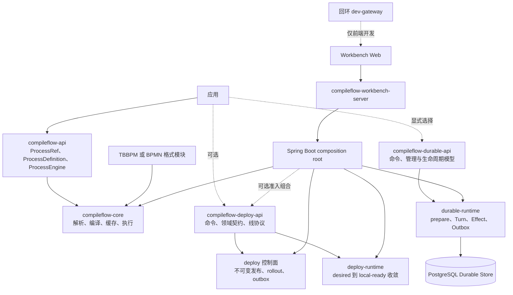

# CompileFlow 架构概览

CompileFlow 是绑定流程格式、采用“编译后执行”模式的流程引擎。可选产品提供热部署、Durable 持久化执行和浏览器端
Workbench。本文用于快速了解整体结构，具体契约由各链接文档定义。

## 产品结构



可复用 Engine 路径只需要 `compileflow-api` 和一个格式模块。部署、Server 与 Workbench 是可选产品层，不是进程内执行的前置条件。

## 核心执行

公共边界将 definition source 与已发布引用分开：

- `ProcessDefinition` 通过 `Inline` 或 `Classpath` 提供或定位定义。
- `ProcessRef.Version` 选择一个精确不可变版本。
- `ProcessRef.Alias` 选择一个已发布路由。

```java
ProcessDefinition definition =
        ProcessDefinition.classpath("order.process", "flows/order.bpm");
ProcessResult<Map<String, Object>> result =
        engine.execute(definition, Map.of("orderId", "A-42"));
```

执行管线为：

```text
request
  -> 解析一次有界 byte snapshot
  -> 校验与解析
  -> 生成 Java
  -> 按精确本地 ProcessRuntimeIdentity 单次编译
  -> 缓存并持有
  -> 执行
  -> 返回类型化结果与受控归因
```

`ProcessRuntimeIdentity` 是 Engine 本地身份，包含精确 source digest、model type、编译管线 identity 和 class-loader
identity。它不是可移植的编译制品 ID，也不会持久化。

## 路由与部署

已发布版本不可变。一个 Alias 包含一个 stable 和最多一个带 BPS 权重的 candidate；Alias revision 是唯一排序字段。

控制面原子提交 route、rollout history 与 outbox。发布版本是独立操作，永远不会切流或安装本地 runtime。

每个 runtime 节点维护两个事实：

- **desired**：从存储或传输收到的最新权威 Alias 状态；
- **local-ready**：stable/candidate runtime 都已在本地持有的最新 route。

节点只有在所有所需 runtime 安装成功并重新确认 desired revision 后，才发布 local-ready route。安装失败保留原 local-ready
route。没有有效 local-ready route 时执行 fail-closed，绝不会在已提交 route 背后降级到旧版本。

## Durable 执行

Durable 是独立于普通 `ProcessEngine` 和 Workbench 整次调用异步队列的显式产品面。Start 接受显式 Definition、精确
Version 或 Alias；Alias 只在准入时由外层组合解析一次。三条路径都会物化不可变的已存储 Process 语义，并把 Run
绑定到精确 Process ID。Version 可以保留为准入归因，但恢复不会再通过 Version 或 Alias 路由。Kernel 持久化 Process
Definition、可移植 continuation snapshot 和已经提交的执行事实。Generated Program、Bytecode、派生 Schema
和当前应用 Provider 都是可丢弃的 Runtime 制品。每个有界 Machine Turn 都把完整下一 continuation、精确 occurrence
消费、新 occurrence 请求和 disposition 原子提交到 PostgreSQL。

执行面通过带 revision 与随机 token 的租约领取 Run、Effect 与 Outbox；维护面负责过期租约、Timer、取消和有界 Outbox
恢复。应用、Provider 与 Runtime 兼容性以及基础设施自动化都不属于内核。

完整的组件、状态、事务、安全与维护模型见
[Durable 架构](10-DURABLE_ARCHITECTURE.zh.md)。

## 扩展模型

provider 与 plugin 在构建 `ProcessEngineConfig` 时解析。校验后的结果保持不可变，并由使用该配置创建的 Engine
共享。注册方式和优先级见[扩展指南](../zh/extension-guide.md)。

## 配置

外部配置只在边界解析一次：

| 前缀                             | 所有者              |
|----------------------------------|---------------------|
| `compileflow.engine.*`           | Engine 配置         |
| `compileflow.deploy.*`           | 部署控制面/数据面   |
| `compileflow.workbench.server.*` | Server 产品设置     |
| `COMPILEFLOW_DEV_GATEWAY_*`      | 回环开发 mock       |
| `VITE_COMPILEFLOW_*`             | 公开 Web 构建时输入 |

Spring datasource、server、management 与 logging 设置继续使用标准前缀。未知 CompileFlow Spring 属性会使绑定失败。

## 支持的运行时基线

CompileFlow 发布 Java 17 bytecode，支持安装最新安全更新的 Java 17、21、25 LTS 运行时。生成流程源码与 bytecode 同样固定为 Java
17。Java 21/25 可通过内部 executor 策略使用虚拟线程；所有支持 JDK 的公共 API 完全一致。

## 设计性质

- 唯一规范执行模型是 `Map<String, Object>`；typed DTO 方法只是适配器。
- 精确 bytes 决定 source identity。
- Runtime cache 有界、single-flight、retain-aware，并由 Engine 拥有。
- Routing key 只存在于 request-to-policy 路径。
- 控制面提交与节点收敛是两个独立可观测里程碑。
- 回滚创建新 rollout，绝不改写历史。
- 默认指标使用有界基数；详细业务身份进入 diagnostics、structured logs 与 traces。

## 继续阅读

- [模块地图](03-MODULE_MAP.zh.md)
- [Durable 架构](10-DURABLE_ARCHITECTURE.zh.md)
- [支持面](06-SUPPORTED_SURFACES.zh.md)
- [热部署](../zh/hot-deploy.md)
- [扩展指南](../zh/extension-guide.md)
