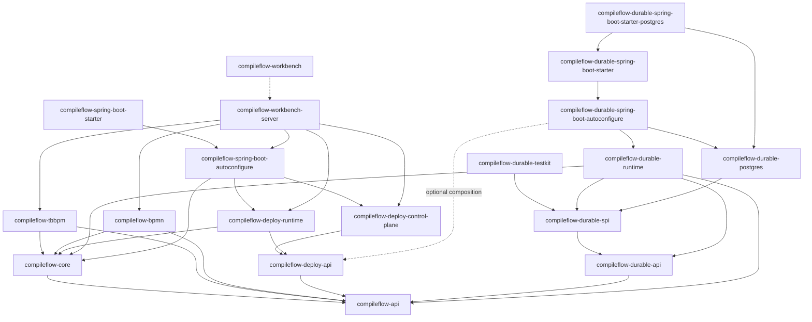

# CompileFlow Module Map

> Prerequisite: [00-OVERVIEW.en.md](00-OVERVIEW.en.md)

The current repository structure defines the module responsibilities, key entry points, and navigation paths below.
Authoritative signatures remain in the source and the [API reference](../en/api-reference.md); this map keeps stable
navigation information without copying implementation fragments that go stale.

---

## 1. Top-level modules

| Module                                  | Role                                  | Primary language | Description                                                                                                     |
|-----------------------------------------|---------------------------------------|------------------|-----------------------------------------------------------------------------------------------------------------|
| `compileflow-api`                       | Public API/SPI                        | Java             | `ProcessEngine`, configuration, preflight, and event-listener contracts.                                        |
| `compileflow-core`                      | Core engine                           | Java             | Model compilation, runtime cache, execution, built-in QL/Java scripts, version routing, events, and observability. |
| `compileflow-tbbpm`                     | TBBPM format frontend                 | Java             | TBBPM model, parser/writer, validation, semantic normalization, and providers.                                  |
| `compileflow-bpmn`                      | BPMN format frontend                  | Java             | BPMN 2.0 model, parser/writer, validation, semantic normalization, and providers.                               |
| `compileflow-deploy`                    | Hot-deploy parent module              | Java             | Control plane, data plane, protocols, and sync-channel SPI.                                                     |
| `compileflow-durable`                   | Durable Process parent module         | Java             | Seven-module persisted execution kernel, PostgreSQL Store, Spring integration, and provider testkit.            |
| `compileflow-spring-boot-autoconfigure` | Spring Boot auto-configuration        | Java             | Auto-configuration for engine, deploy, repository, routing, metrics, and actuator.                              |
| `compileflow-spring-boot-starter`       | Spring Boot starter                   | Java             | User-facing starter dependency aggregation.                                                                     |
| `compileflow-workbench-server`          | Workbench Operate backend             | Java             | REST API, persistence, execution logs, async invocation, deployment control, and runtime diagnostics.           |
| `compileflow-integration-tests`         | Integration tests                     | Java             | Cross-module behavior verification.                                                                             |
| `compileflow-workbench`                 | Visual workbench                      | TypeScript/Node  | Web UI, loopback development mock, and Operate/Build/Learn experience.                                          |

The Maven modules declared in the root `pom.xml` do not include `compileflow-workbench`; the Workbench uses an
independent pnpm workspace.

The repository also has four profile-gated auxiliary Maven roots. They are not part of the default reactor or the product
runtime:

| Path                                            | Profile      | Purpose                                              |
|-------------------------------------------------|--------------|------------------------------------------------------|
| `examples/spring-boot-basic`                    | `examples`   | Runnable starter integration example.                |
| `examples/spring-boot-order-fulfillment`        | `examples`   | Realistic synchronous order-fulfillment application. |
| `examples/spring-boot-durable-postgres`         | `examples`   | Runnable Durable PostgreSQL example.                  |
| `compileflow-benchmarks`                        | `benchmarks` | JMH evidence for engine hot paths.                    |

### Naming and placement rules

- A published artifact is named after one stable capability: `api`, `core`, a format, a deployment plane,
  auto-configuration, or a product server.
- Java packages follow domain and capability boundaries. Generic `impl`, `common`, `util`, and `transport` packages are
  not used as catch-alls.
- Supported engine and deployment contracts use `Process`. `Flow` remains appropriate for editable Workbench resources
  and format-specific graph models.
- `api` and `spi` state contract roles. The supported-surfaces specification, rather than a generic package label or
  Java `public` modifier, defines product support.
- Interfaces describe a role without an `I` prefix. Implementations use a qualifier only when multiple meaningful
  implementations exist.
- The dependency-only starter contains no runtime classes. Workbench packages use the `@compileflow` npm scope.

Type suffixes are role names, not decorative layers:

| Suffix                   | Repository-wide meaning                                                  |
|--------------------------|--------------------------------------------------------------------------|
| `Engine`                 | Application-facing Process execution surface; resource ownership is an implementation concern |
| `Service`                | Cohesive command/query or tooling facade without whole-runtime ownership |
| `Manager`                | Subordinate lifecycle or ownership administration                        |
| `Store` / `Repository`   | Atomic kernel persistence port / application collection persistence      |
| `Provider` / `Factory`   | Replaceable extension supply / caller-visible construction               |
| `Registry`               | Keyed registration and lookup                                            |
| `Worker` / `Coordinator` | Autonomous background work / framework lifecycle composition             |
| `Resolver` / `Router`    | Identity resolution / authorized alternative selection                   |
| `Mapper` / `Codec`       | Object-shape mapping / deterministic byte representation                 |

Consequently, `ProcessEngine` and `DurableProcessEngine` are sibling application-facing execution surfaces. The former
executes an invocation; the latter creates and mutates a persistent Run while independently managed Durable Workers
advance it. Neither surface implies ownership of every executor or Worker lifecycle. These role names are the current
repository rule and are reflected by the public and internal boundaries in
[Supported Surfaces](06-SUPPORTED_SURFACES.en.md).

---

## 2. `compileflow-api`

This artifact has no runtime dependencies and is the stable Java contract for users and upper-layer modules. API and SPI
use separate packages but remain in one artifact because their public types refer to each other.

| Class/Package                                       | Responsibility                                                                                                               |
|-----------------------------------------------------|------------------------------------------------------------------------------------------------------------------------------|
| `ProcessEngine`                                     | Executes `execute(...)`, starts named entries through `trigger(...)`, and exposes `runtime()` / `tooling()` service entries. |
| `ProcessRef`                                        | Identifies an exact published version or published Alias without carrying definition content.                                 |
| `ProcessDefinition`                                 | Supplies an inline or classpath-resource definition source without publication coordinates.                                 |
| `ProcessResult`, `ProcessError`, `ProcessExecution` | Typed success/failure outcome and controlled execution attribution.                                                          |
| `ProcessRuntimeManager`                             | Node-local exact warm-up, immutable-version load, and ownership release.                                                     |
| `ProcessToolingService`                             | Non-executing preflight and format-neutral Java source generation.                                                           |
| `ProcessEngineFactory`                              | Creates TBBPM/BPMN engines through SPI in non-Spring scenarios.                                                              |
| `ProcessDataMapper`                                 | Maps typed input/output at the canonical variable-map boundary.                                                              |
| `config/*`                                          | Reusable immutable configuration snapshots, builders, and validation; the convergence point of extension capabilities.       |
| `preflight/*`                                       | `ProcessPreflightOptions` and `ProcessPreflightReport`.                                                                      |
| engine root package                                 | Core value types, exceptions, error codes, and model type enum.                                                              |
| `spi/*`                                             | Engine providers, plugins, component resolution, and extension support contracts.                                            |
| `spi/event/*`                                       | `ProcessEvent` and `ProcessEventListener`.                                                                                   |
| `spi/execution/*`                                   | Retry, terminal failure-policy, and application-context propagation contracts.                                               |
| `spi/routing/*`                                     | Alias target policy and advanced version-routing contracts.                                                                  |
| `spi/script/*`                                      | `ScriptExecutor`.                                                                                                            |
| `spi/observability/*`                               | `TraceIdProvider`.                                                                                                           |

Code
entry: [compileflow-api/src/main/java/com/alibaba/compileflow/engine](../../compileflow-api/src/main/java/com/alibaba/compileflow/engine)

---

## 3. `compileflow-core`

The core engine turns process definitions into executable runtimes and handles caching, version routing, and context
propagation on the execution path.

| Package            | Responsibility                                                                                                                                                                                     |
|--------------------|----------------------------------------------------------------------------------------------------------------------------------------------------------------------------------------------------|
| `source`, `xml`   | Bounded source loading, resolved definitions, format-neutral reader contracts, and shared XML parsing infrastructure.                                                                              |
| `validation`       | Format-neutral validation result and failure contracts used before semantic compilation.                                                                                                          |
| `semantic`         | `ProcessSemanticCompiler`, its format-provider boundary, and the single immutable `ProcessSemanticPlan` with closed semantic variants.                                                           |
| `analysis`         | Structured branch, ownership, and merge analysis derived only from the semantic plan.                                                                                                             |
| `runtime`          | `ProcessRuntime`, compiled/interpreted realizations, cache/loading, action execution, execution context, and runtime resolution.                                                                   |
| `runtime/resolution` | `ProcessRuntimeResolver`, responsible for source lookup, version resolution, cache hit, and compilation triggering.                                                                                |
| `assembly`         | `EngineAssembly`, immutable `EngineDependencies`, and construction-time format-provider selection; re-wiring dependencies after engine creation is forbidden.                                      |
| `java`             | Shared generated-Java emission, in-memory compilation, diagnostics, and Java type/source utilities.                                                                                                |
| `executor`, `lifecycle` | Engine-owned bounded executors, cancellation/shutdown budgets, and operation-drain lifecycle.                                                                                              |
| `model`, `type`   | Source-neutral model primitives and bounded Java data-type resolution.                                                                                                                             |
| `routing`   | `LocalRoutingState`, installed-version and alias-route state, published Alias composition, deterministic target selection, and fail-closed route admission.                                             |
| `preflight`        | `ProcessPreflightService` and flow checkers.                                                                                                                                                       |
| `event`            | A publisher that reads per-engine listener snapshots and dispatches in isolation.                                                                                                                  |
| `classloader`      | Resolves the effective parent ClassLoader (explicit, thread-context, or the library's own) for generated code.                                                                                     |
| `observability`    | Trace identifiers; Micrometer integration is provided by Spring auto-configuration.                                                                                                                |

Key entry points:

| Class                           | Description                                                                                                               |
|---------------------------------|---------------------------------------------------------------------------------------------------------------------------|
| `DefaultProcessEngine`          | The single TBBPM/BPMN engine implementation; owns execution, runtime lifecycle, and non-executing tooling views.        |
| `AssembledProcessEngineFactory` | Construction-time factory used by the Spring/deploy composition root; loads only the internal assembled provider.         |
| `ProcessRuntimeResolver` | Core path that obtains or compiles a runtime before execution.                                                                   |
| `DefaultProcessRuntimeLoader`   | Source loading, semantic compilation, runtime realization, and single-flight deduplication.                             |
| `ProcessSemanticCompiler`       | Runs the selected format frontend once and derives the structured plan without retaining source AST.                     |
| `ProcessSemanticPlan`           | Stable source-neutral Process semantics and canonical digest; the only semantic truth consumed by execution backends.    |
| `StructuredControlFlowAnalyzer` | Derives branch regions, ownership, and merge structure from `ProcessSemanticPlan`.                                        |
| `JavaProcessCodeGenerator`      | Emits readable specialized Java from semantic and structured plans, with no source-format dependency.                    |
| `CompiledProcessRuntime`        | Executes generated specialized Java through the `ProcessEngine` runtime contract.                                      |
| `InterpretedProcessRuntime`     | Executes the same semantic/structured plans directly through the `ProcessEngine` runtime contract.                     |
| `ProcessEngineExecutors`        | Owns compilation, preflight, action-timeout, branch-orchestration, and event-delivery executors.                      |
| `AliasAdmission`     | Admits one serving route and preserves exact Alias attribution across execution dispatch.                                 |
| `LocalReadyAliasRouteSource` | Default serving authority backed by the atomically published node-local-ready route projection.                   |
| `DeterministicAliasSelector`           | Protocol-defined SHA-256/BPS selector over an admission-supplied effective cohort key.                                    |
| `LocalRoutingState`           | Container for `LocalAliasRouteState` and `InstalledVersionState`.                                                        |

Code
entry: [compileflow-core/src/main/java/com/alibaba/compileflow/engine/core](../../compileflow-core/src/main/java/com/alibaba/compileflow/engine/core)

---

## 4. `compileflow-tbbpm` and `compileflow-bpmn`

The two format modules integrate with the plain-Java `ProcessEngineFactory` through the public `ProcessEngineProvider`,
and integrate with the Spring/deploy composition root (which needs atomic injection of deployment state) through the
core-internal assembled-provider contract.

| Module              | Key responsibilities                                                        |
|---------------------|-----------------------------------------------------------------------------|
| `compileflow-tbbpm` | TBBPM XML model, parser/writer, validator, semantic frontend, and provider. |
| `compileflow-bpmn`  | BPMN 2.0 model, parser/writer, validator, semantic frontend, and provider.  |

Location guidance:

| Need                           | Location                                                             |
|--------------------------------|----------------------------------------------------------------------|
| Add or fix XML element parsing | The format module's `parser`.                                        |
| Modify XML output              | The format module's `writer`.                                        |
| Modify semantic normalization  | The format module's `semantic`.                                      |
| Modify generated code          | Core `java/codegen`.                                                  |
| Modify model definitions       | The format module's `model`.                                         |
| Modify validation rules        | The format module's `validation` or Workbench front-end validation.  |

---

## 5. `compileflow-deploy`

The hot-deploy module is split into control plane and data plane. The `EMBEDDED` topology uses PostgreSQL through JDBC
as the source of truth, activates committed Aliases through the local-ready pipeline, and retains outbox replay for
recovery; the `DISTRIBUTED` topology connects independently deployable control and data planes through a sync channel.
`Jdbc*Repository` describes the access mechanism, not support for arbitrary JDBC databases. Neither topology can
silently fall back to ephemeral in-memory state. See the
[configuration contract](../en/configuration.md) and [Deploy protocol](../../compileflow-deploy/docs/PROTOCOL.md) for
the governing constraints.

| Submodule                          | Responsibility                                                                                                           |
|------------------------------------|--------------------------------------------------------------------------------------------------------------------------|
| `compileflow-deploy-api`           | Public deployment facade, commands, views, errors, routing/artifact protocols, and synchronization SPI.                  |
| `compileflow-deploy-control-plane` | Deployment facade implementation, immutable publication, version/alias/rollout repositories, outbox, and reconciliation. |
| `compileflow-deploy-runtime`       | `DeployRuntime`, routing-state subscriber, demand planner, artifact resolver, runtime installer.                         |

Control-plane key classes:

| Class                             | Description                                                                                                                            |
|-----------------------------------|----------------------------------------------------------------------------------------------------------------------------------------|
| `ProcessDeploymentService`        | Public facade contract in `compileflow-deploy-api`: publish versions; create, inspect, update, promote, abort, and roll back rollouts. |
| `DefaultProcessDeploymentService` | Thin facade, responsible for request id, exception wrapping, and result objects.                                                       |
| `RolloutControlService`           | Coordinates route mutations, rollout revisions, and audit history.                                                                     |
| `VersionPublicationService`       | Validates and persists exact immutable source identity without installing a runtime.                                                   |
| `ArtifactProjectionCoordinator`      | DB/CHANNEL artifact publish strategy.                                                                                                  |
| `RoutingOutboxDispatcher`         | Single dispatch point for committed routing state; targets can be local state or a remote channel.                                     |
| `RoutingProjectionReconciler`  | Repairs sync drift from the repository source of truth.                                                                                |

Data-plane key classes:

| Class                                  | Description                                                                          |
|----------------------------------------|--------------------------------------------------------------------------------------|
| `DeployRuntime`                        | Spring-lifecycle-managed runtime owner, exposes `start()`, `stop()`, `snapshot()`.   |
| `DeploymentSyncRoutingStateSubscriber` | Receives routing state from the sync channel.                                        |
| `VersionDemandPlanner`                 | Computes install/uninstall demand from the union of current alias routes.            |
| `ProcessArtifactSource`                | Narrow data-plane SPI for resolving an immutable artifact by typed version identity. |
| `RepositoryProcessArtifactResolver`    | Resolves artifacts through `ProcessArtifactSource` in DB mode.                       |
| `ChannelProcessArtifactResolver`       | Resolves artifacts from the sync channel in CHANNEL mode.                            |
| `RuntimeInstaller`                     | Installation, retention, release, shared failure backoff, and diagnostics.           |

Protocols:

| Protocol           | Key shape                                       |
|--------------------|-------------------------------------------------|
| RoutingState alias | `compileflow.deployment.alias.{identityDigest}` |
| ProcessArtifact    | `compileflow.process.version.{identityDigest}`  |

`identityDigest` is lowercase SHA-256 over an ordered, length-prefixed UTF-8 identity tuple. Payloads retain and verify
the complete identity; the digest keeps transport keys unambiguous and bounded.

Code entry: [compileflow-deploy](../../compileflow-deploy)

---

## 6. `compileflow-durable`

Durable is opt-in and has a separate public API from the `ProcessEngine`. It lowers supported TBBPM and BPMN
into a disposable Durable Machine. Each bounded Turn commits its complete continuation, exact occurrence consumption,
new requests, and disposition atomically; PostgreSQL is the production authority.

| Submodule                                       | Responsibility                                                                                                                                                                           |
|-------------------------------------------------|------------------------------------------------------------------------------------------------------------------------------------------------------------------------------------------|
| `compileflow-durable-api`                       | Version/Alias Start commands, sanitized views, registration, Run control, Effect resolution, and operator contracts.                                                                    |
| `compileflow-durable-spi`                       | Narrow integration ports plus first-party Kernel Store provider contracts; visibility does not promise a supported third-party Store ecosystem.                                       |
| `compileflow-durable-runtime`                   | Structural preparation, disposable compilation, typed snapshots, services, demand-driven recovery, lease renewal, and Workers consuming narrow Store roles.                             |
| `compileflow-durable-postgres`                  | PostgreSQL authority, the current seven-table greenfield Flyway V1 layout, queues, database time, Run-first lock ordering, leases, and token fencing; table count is not a Kernel invariant. |
| `compileflow-durable-spring-boot-autoconfigure` | Provider-neutral Runtime composition plus optional first-party Provider auto-configurations under the Durable-owned `com.alibaba.compileflow.durable.spring.boot.autoconfigure` package. |
| `compileflow-durable-spring-boot-starter`       | Provider-neutral dependency entry point for a supplied `DurableStore`.                                                                                                                   |
| `compileflow-durable-spring-boot-starter-postgres` | First-party PostgreSQL distribution aggregating the neutral starter, PostgreSQL Store, JDBC, Flyway, and driver.                                                                       |
| `compileflow-durable-testkit`                   | Published JUnit 5 first-party Kernel Store transaction contract; test scope only and not an alternative-Store SPI.                                                                        |

Applications using the first-party Provider normally depend only on the PostgreSQL starter. The Store testkit verifies
the provider-neutral transaction protocol; each supported Provider must independently prove it. Deployment control planes, infrastructure
adapters, and server distributions are intentionally outside the kernel.

Code and user guide:
[compileflow-durable](../../compileflow-durable) ·
[Durable Process guide](../en/durable-process.md)

---

## 7. Spring Boot auto-configuration

`compileflow-spring-boot-autoconfigure` provides multiple auto-configuration classes rather than a single umbrella
configuration.

| Class                                            | Responsibility                                                                                                         |
|--------------------------------------------------|------------------------------------------------------------------------------------------------------------------------|
| `CompileFlowEnginePropertiesAutoConfiguration`      | Strictly binds and validates engine and deployment configuration before feature composition.                           |
| `CompileFlowCoreAutoConfiguration`               | Creates the `ProcessEngine`, collects listener beans, and exposes its runtime-management and tooling capability views. |
| `CompileFlowRepositoryAutoConfiguration`         | JDBC version/alias repositories.                                                                                       |
| `CompileFlowDeploymentMetricsAutoConfiguration`  | Instance-scoped deployment metrics and optional Micrometer export.                                                     |
| `CompileFlowDeployControlPlaneAutoConfiguration` | Deploy control-plane services, artifact publisher, release strategy, and distributed reconciliation.                   |
| `CompileFlowDeployDataPlaneAutoConfiguration`    | `DeployRuntime` data-plane pipeline.                                                                                   |
| `CompileFlowEmbeddedDataPlaneAutoConfiguration`  | Synchronous local-ready convergence for the embedded topology.                                                         |
| `CompileFlowDeployOutboxAutoConfiguration`       | Outbox repository, delivery target, dispatcher, and scheduler.                                                         |
| `CompileFlowDeployRoutingAutoConfiguration`      | Single Alias route source, named targeting policies, and node-local routing-state wiring.                              |
| `CompileFlowMetricsAutoConfiguration`            | Metrics binder.                                                                                                        |
| `CompileFlowDeployActuatorAutoConfiguration`           | Health/diagnostics actuator integration.                                                                               |

Configuration property classes live under `properties/*`; see the [configuration guide](../en/configuration.md) for
public configuration. Durable auto-configuration uses its own
`com.alibaba.compileflow.durable.spring.boot.autoconfigure`
package tree. Published library artifacts must not split an exact Java package; integration collaborators live in
semantic packages such as `lifecycle`, `routing`, `resolution`, and `observability`.

Code
entry: [compileflow-spring-boot-autoconfigure/src/main/java/com/alibaba/compileflow/engine/spring/boot/autoconfigure](../../compileflow-spring-boot-autoconfigure/src/main/java/com/alibaba/compileflow/engine/spring/boot/autoconfigure)

---

## 8. `compileflow-workbench-server`

`compileflow-workbench-server` is the independent Java backend of the Workbench product and is not part of the reusable
engine starter.

| Package      | Responsibility                                                                                                           |
|--------------|--------------------------------------------------------------------------------------------------------------------------|
| `api`        | Workbench Server request/response records, request validation, and RFC 9457 problem handling.                            |
| `process`    | Editable process CRUD and validation through `ProcessDraftService`, persisted through `ProcessDraftRepository`.              |
| `deployment` | Publication, rollout, route mutation, canary health, and deployment control.                                             |
| `execution`  | Workbench whole-invocation async API, worker, lease, and dead-letter requeue.                                            |
| `monitoring` | Metrics, persisted execution logs, runtime diagnostics, and trend buckets.                                               |
| `learn`      | Learn example catalog API.                                                                                               |
| `security`   | API key filter and fail-closed authentication-mode guard.                                                                |
| `config`     | Server-specific typed properties.                                                                                        |

Server controllers and API records generate the Workbench wire shape. The committed OpenAPI description is the wire
authority. Generated TypeScript, refined Workbench domain types, runtime validation, and compile-time parity assertions
prevent drift while allowing domain types to remain more specific than plain wire strings.

Code
entry: [compileflow-workbench-server/src/main/java/com/alibaba/compileflow/workbench/server](../../compileflow-workbench-server/src/main/java/com/alibaba/compileflow/workbench/server)

---

## 9. Quick navigation

| Question                                     | Preferred path                                                                                             |
|----------------------------------------------|------------------------------------------------------------------------------------------------------------|
| Public API or usage unclear                  | `compileflow-api` and `docs/en/api-reference.md`.                                                          |
| Slow first execution or repeated compilation | `ProcessRuntimeResolver`, `DefaultProcessRuntimeLoader`, cache configuration.                                |
| BPMN/TBBPM parsing incorrect                 | The format module's parser, model, and validator.                                                          |
| Java generated code incorrect                | `ProcessSemanticPlan`, `StructuredControlFlowAnalyzer`, and Core `java/codegen`.                            |
| Version routing not as expected              | `AliasAdmission`, `AliasTargetSelector`, `DeterministicAliasSelector`, `LocalRoutingState`, `InstalledVersionState`. |
| Publish/canary/rollback exceptions           | `ProcessDeploymentService`, `VersionPublicationService`, `ArtifactProjectionCoordinator`, repositories, outbox. |
| Runtime node did not install a version       | `DeployRuntime`, `VersionDemandPlanner`, artifact resolver, `RuntimeInstaller.snapshot()`.                 |
| Durable Run cannot start, resume, or recover | `DurableProcessEngine`, process readiness, `ProcessRun`, `DurableStore`, and Worker health.             |
| Current application capability is absent     | Process readiness, Action/Script registration, and Worker backlog; Kernel performs no compatibility routing. |
| Spring Boot configuration not effective      | autoconfigure classes, `ProcessEngineProperties`, `CompileFlowWorkbenchServerProperties`.                  |
| Workbench Operate API inconsistent           | `compileflow-workbench-server` controllers/tests vs Workbench contracts.                                   |

---

## 10. Dependency graph

---

## 11. Next steps

- Read [04-EXECUTION_FLOW.en.md](04-EXECUTION_FLOW.en.md) for the execution path.
- Read [05-VERSION_ROUTING.en.md](05-VERSION_ROUTING.en.md) for version routing and deploy runtime convergence.
- Read the [Durable Architecture](10-DURABLE_ARCHITECTURE.en.md) for persisted execution, transactions, recovery, and
  maintenance boundaries.
- Read the [Durable Process guide](../en/durable-process.md) for persisted execution and recovery.
- Read the [configuration guide](../en/configuration.md) to cross-reference Spring Boot properties and runtime behavior.
