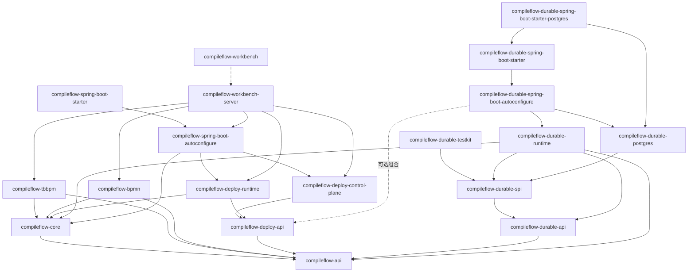

# CompileFlow 模块地图

> 前置阅读：[00-OVERVIEW.zh.md](00-OVERVIEW.zh.md)

以下模块职责、关键入口和定位路径与当前仓库结构一致。接口签名以源码和
[API 参考](../zh/api-reference.md) 为准；模块地图只保留稳定导航信息，不复制容易过期的实现片段。

---

## 1. 顶层模块

| 模块                                    | 角色                   | 主要语言        | 说明                                                                     |
|-----------------------------------------|------------------------|-----------------|--------------------------------------------------------------------------|
| `compileflow-api`                       | 公共 API/SPI           | Java            | `ProcessEngine`、配置、preflight 和事件监听契约。                        |
| `compileflow-core`                      | 核心引擎               | Java            | 模型编译、运行时缓存、执行、内置 QL/Java 脚本、版本路由、事件分发和可观测性实现。 |
| `compileflow-tbbpm`                     | TBBPM 格式前端         | Java            | TBBPM 模型、parser/writer、校验、语义归一化与 provider。                 |
| `compileflow-bpmn`                      | BPMN 格式前端          | Java            | BPMN 2.0 模型、parser/writer、校验、语义归一化与 provider。              |
| `compileflow-deploy`                    | 热部署父模块           | Java            | 控制面、数据面、协议和同步通道 SPI。                                     |
| `compileflow-durable`                   | Durable Process 父模块 | Java            | 持久化执行产品、PostgreSQL Store、Spring 集成与 Provider Testkit。       |
| `compileflow-spring-boot-autoconfigure` | Spring Boot 自动配置   | Java            | 引擎、deploy、repository、routing、metrics、actuator 自动配置。          |
| `compileflow-spring-boot-starter`       | Spring Boot starter    | Java            | 面向用户的 starter 依赖聚合。                                            |
| `compileflow-workbench-server`          | Workbench Operate 后端 | Java            | REST API、持久化、执行日志、持久化异步调用、部署控制和运行时诊断。       |
| `compileflow-integration-tests`         | 集成测试               | Java            | 跨模块行为验证。                                                         |
| `compileflow-workbench`                 | 可视化工作台           | TypeScript/Node | Web UI、回环开发 mock 与 Operate/Build/Learn 体验。                      |

根 `pom.xml` 声明的 Maven 模块不包含 `compileflow-workbench`，Workbench 使用独立 pnpm workspace。

仓库还有四个由 profile 控制的辅助 Maven 构建根；它们不属于默认 reactor 或产品运行时：

| 路径                                            | Profile      | 用途                                      |
|-------------------------------------------------|--------------|-------------------------------------------|
| `examples/spring-boot-basic`                    | `examples`   | 可运行的 starter 集成示例。               |
| `examples/spring-boot-order-fulfillment`        | `examples`   | 真实的同步订单履约应用。                  |
| `examples/spring-boot-durable-postgres`         | `examples`   | 可运行的 Durable PostgreSQL 示例。        |
| `compileflow-benchmarks`                        | `benchmarks` | 为引擎热路径提供 JMH 性能证据。           |

### 命名与放置规则

- 发布 artifact 按一个稳定能力命名：`api`、`core`、格式、部署平面、自动配置或产品 Server。
- Java package 按领域和能力划分，不使用通用 `impl`、`common`、`util`、`transport` 作为兜底目录。
- 受支持的引擎与部署契约统一使用 `Process`；可编辑的 Workbench 资源和格式内部图模型继续使用 `Flow`。
- `api` 与 `spi` 表达契约角色；产品支持面由支持面规范决定，不由通用包标签或 Java `public` 修饰符决定。
- 接口直接表达角色，不加 `I` 前缀；只有存在多个有意义实现时，具体实现才增加限定词。
- 纯依赖 starter 不包含运行时 class；Workbench package 统一使用 `@compileflow` npm scope。

类型后缀表示架构角色，不是装饰性的分层名称：

| 后缀                     | 全仓统一语义                                             |
|--------------------------|----------------------------------------------------------|
| `Engine`                 | 持有资源、在进程内直接执行并具有显式生命周期的执行所有者 |
| `Service`                | 不持有完整运行时的内聚 command/query 或 tooling 门面     |
| `Manager`                | 从属生命周期或 ownership 管理                            |
| `Store` / `Repository`   | 内核原子持久化端口 / 应用集合持久化                      |
| `Provider` / `Factory`   | 可替换扩展供给 / 面向调用方的构造入口                    |
| `Registry`               | 按 key 注册和查找                                        |
| `Worker` / `Coordinator` | 自主后台工作 / 框架生命周期编排                          |
| `Resolver` / `Router`    | 身份解析 / 已授权候选项选择                              |
| `Mapper` / `Codec`       | 对象结构映射 / 确定性字节表示                            |

因此，`ProcessEngine` 与 `DurableProcessEngine` 是同级的应用侧执行入口：前者执行一次 invocation，后者创建和
修改持久化 Run，并由独立管理的 Durable Worker 推进它们。`Engine` 不表示必须由该对象拥有所有 executor 或
Worker 生命周期；这些是实现拓扑。当前执行词汇与公共、内部边界见
[支持面清单](06-SUPPORTED_SURFACES.zh.md)。

---

## 2. `compileflow-api`

该 artifact 没有生产依赖，是用户和上层模块使用的稳定 Java 契约。API 与 SPI 通过 package 区分，但公开类型相互引用，因此保留在同一个
artifact 中。

| 类/包                                               | 职责                                                                                              |
|-----------------------------------------------------|---------------------------------------------------------------------------------------------------|
| `ProcessEngine`                                     | 执行 `execute(...)`、通过 `trigger(...)` 启动命名入口，并暴露 `runtime()`、`tooling()` 服务入口。 |
| `ProcessRef`                                        | 按 code、精确不可变 version 或已发布 Alias 标识已有流程，不携带定义内容。                           |
| `ProcessDefinition`                                 | 提供显式 inline 或 classpath 定义，不携带 namespace、version、alias 或模型类型。                 |
| `ProcessResult`、`ProcessError`、`ProcessExecution` | typed success/failure 结果和受控执行归因。                                                        |
| `ProcessRuntimeManager`                             | 节点本地精确 warm-up、immutable-version load 与 ownership release。                               |
| `ProcessToolingService`                             | 不执行流程的 preflight 与格式无关 Java 源码生成。                                                 |
| `ProcessEngineFactory`                              | 非 Spring 场景通过 SPI 创建 TBBPM/BPMN 引擎。                                                     |
| `ProcessDataMapper`                                 | 在规范变量 Map 边界映射 typed input/output。                                                      |
| `config/*`                                          | 可复用不可变配置快照、builder 和校验；扩展能力的汇合点。                                          |
| `preflight/*`                                       | `ProcessPreflightOptions` 与 `ProcessPreflightReport`。                                           |
| engine 根包                                         | 核心值类型、异常、错误码和模型类型枚举。                                                          |
| `spi/*`                                             | Engine provider、plugin、component resolution 与扩展支持契约。                                    |
| `spi/event/*`                                       | `ProcessEvent` 与 `ProcessEventListener`。                                                        |
| `spi/execution/*`                                   | Retry、terminal failure policy 与应用上下文传播契约。                                             |
| `spi/routing/*`                                     | 已发布 Alias target policy 与高级 version routing 契约。                                            |
| `spi/script/*`                                      | `ScriptExecutor`。                                                                                |
| `spi/observability/*`                               | `TraceIdProvider`。                                                                               |

代码入口：[compileflow-api/src/main/java/com/alibaba/compileflow/engine](../../compileflow-api/src/main/java/com/alibaba/compileflow/engine)

---

## 3. `compileflow-core`

核心引擎负责把流程定义变成可执行运行时，并在执行路径上处理缓存、版本路由和上下文传播。

| 包                 | 职责                                                                                                                                     |
|--------------------|------------------------------------------------------------------------------------------------------------------------------------------|
| `source`、`xml`  | 有界 source loading、resolved definition、format-neutral reader 契约与共享 XML 解析基础设施。                                             |
| `validation`      | 语义编译前使用的 format-neutral 校验结果与失败契约。                                                                                       |
| `semantic`        | `ProcessSemanticCompiler`、format provider 边界，以及包含闭合语义变体的唯一不可变 `ProcessSemanticPlan`。                                 |
| `analysis`        | 只从 semantic plan 派生结构化 branch、ownership 与 merge 分析。                                                                           |
| `runtime`         | `ProcessRuntime`、compiled/interpreted realization、缓存/loading、Action 执行、执行上下文和 runtime resolution。                         |
| `runtime/resolution` | `ProcessRuntimeResolver`，负责 source lookup、版本解析、缓存命中和编译触发。                                                             |
| `assembly`        | `EngineAssembly`、不可变 `EngineDependencies` 与构造期 format-provider 选择；禁止 engine 创建后的依赖重接线。                            |
| `java`            | 共享 generated-Java 生成、内存编译、诊断与 Java 类型/source 工具。                                                                         |
| `executor`、`lifecycle` | Engine 持有的有界执行器、取消/关闭预算与 operation-drain 生命周期。                                                               |
| `model`、`type`  | Source-neutral model primitive 与有界 Java data-type 解析。                                                                                |
| `routing`   | `LocalRoutingState`、installed-version 与 alias-route state、已发布 Alias 组合、确定性 target 选择与失败关闭的 route admission。         |
| `preflight`        | `ProcessPreflightService` 和 flow checker。                                                                                              |
| `event`            | 读取每引擎 listener 快照并隔离分发的 publisher。                                                                                         |
| `classloader`      | 为生成代码解析显式、线程上下文和库自身的有效父 ClassLoader。                                                                             |
| `observability`    | trace identifier；Micrometer 集成由 Spring auto-configuration 提供。                                                                     |

关键入口：

| 类                              | 说明                                                                                        |
|---------------------------------|---------------------------------------------------------------------------------------------|
| `DefaultProcessEngine`          | TBBPM/BPMN 共用的唯一引擎实现；持有执行、runtime 生命周期与非执行 tooling 视图。                  |
| `AssembledProcessEngineFactory` | Spring/deploy 组合根使用的构造期工厂，只加载 core 内部 assembled provider。                 |
| `ProcessRuntimeResolver` | 执行前获取或编译 runtime 的核心路径。                                                              |
| `DefaultProcessRuntimeLoader`   | source loading、语义编译、runtime realization 与 single-flight dedup。                       |
| `ProcessSemanticCompiler`       | 只运行一次所选 format frontend，并在不保留 Source AST 的前提下派生 structured plan。             |
| `ProcessSemanticPlan`           | 稳定、source-neutral 且带 canonical digest 的唯一 Process 语义真相。                            |
| `StructuredControlFlowAnalyzer` | 从 `ProcessSemanticPlan` 派生 branch region、ownership 与 merge structure。                      |
| `JavaProcessCodeGenerator`      | 只依赖 semantic/structured plan，生成可读、特化且与 source format 无关的 Java。                   |
| `CompiledProcessRuntime`        | 通过普通 `ProcessRuntime` 契约执行特化生成的 Java。                                              |
| `InterpretedProcessRuntime`     | 通过同一普通 `ProcessRuntime` 契约直接执行 semantic/structured plan。                             |
| `ProcessEngineExecutors`        | 负责持有编译、预检、定时动作、分支编排和事件执行器。                                        |
| `AliasAdmission`     | 接纳一个 serving route，并在执行分发过程中保留精确 Alias 归因。                              |
| `LocalReadyAliasRouteSource` | 默认 serving 权威，读取原子发布的节点 local-ready route 投影。                       |
| `DeterministicAliasSelector`           | 对 admission 已补全的有效 cohort key 执行协议固定的 SHA-256/BPS 分桶。                      |
| `LocalRoutingState`           | `LocalAliasRouteState` 与 `InstalledVersionState` 的容器。                                 |

代码入口：[compileflow-core/src/main/java/com/alibaba/compileflow/engine/core](../../compileflow-core/src/main/java/com/alibaba/compileflow/engine/core)

---

## 4. `compileflow-tbbpm` 与 `compileflow-bpmn`

两个格式模块通过公开 `ProcessEngineProvider` 接入普通 Java 的 `ProcessEngineFactory`，并通过 core 内部 assembled-provider
契约接入需要原子注入部署状态的 Spring/deploy 组合根。

| 模块                | 关键职责                                                        |
|---------------------|-----------------------------------------------------------------|
| `compileflow-tbbpm` | TBBPM XML 模型、parser/writer、validator、semantic frontend 与 provider。 |
| `compileflow-bpmn`  | BPMN 2.0 模型、parser/writer、validator、semantic frontend 与 provider。  |

定位建议：

| 需求                    | 位置                                                              |
|-------------------------|-------------------------------------------------------------------|
| 新增或修复 XML 元素解析 | 对应格式模块的 `parser`。                                         |
| 修改 XML 输出           | 对应格式模块的 `writer`。                                         |
| 修改格式语义归一化      | 对应格式模块的 `semantic`。                                       |
| 修改生成代码            | Core 的 `java/codegen`。                                           |
| 修改模型定义            | 对应格式模块的 `model`。                                          |
| 修改校验规则            | 对应格式模块的 `validation` 或 Workbench 前端校验。                |

---

## 5. `compileflow-deploy`

热部署模块分为控制面和数据面。`EMBEDDED` 拓扑通过 JDBC 使用 PostgreSQL 事实源，将已提交 Alias 经 local-ready 链路激活，并保留
outbox 重放作为恢复路径；`DISTRIBUTED` 拓扑通过同步通道连接可独立部署的控制面与数据面。
`Jdbc*Repository` 描述访问机制，不代表支持任意 JDBC 数据库。两者都不能静默回退到临时内存状态，
具体约束见[配置契约](../zh/configuration.md)与
[Deploy 协议](../../compileflow-deploy/docs/PROTOCOL.md)。

| 子模块                             | 职责                                                                                              |
|------------------------------------|---------------------------------------------------------------------------------------------------|
| `compileflow-deploy-api`           | 公共部署 facade、commands、views、errors、routing/artifact 协议与同步 SPI。                       |
| `compileflow-deploy-control-plane` | 部署 facade 实现、不可变发布、version/alias/rollout repositories、outbox 与 reconciliation。      |
| `compileflow-deploy-runtime`       | `DeployRuntime`、routing-state subscriber、demand planner、artifact resolver、runtime installer。 |

控制面关键类：

| 类                                | 说明                                                                                                         |
|-----------------------------------|--------------------------------------------------------------------------------------------------------------|
| `ProcessDeploymentService`        | 位于 `compileflow-deploy-api` 的公共 facade 契约：发布版本，以及创建、查询、调整、提升、中止和回滚 rollout。 |
| `DefaultProcessDeploymentService` | 薄 facade，负责 request id、异常包装和结果对象。                                                             |
| `RolloutControlService`           | 协调 route mutation、rollout revision 与审计历史。                                                           |
| `VersionPublicationService`       | 校验并持久化精确不可变源码 identity，不安装 runtime。                                                        |
| `ArtifactProjectionCoordinator`      | DB/CHANNEL artifact 发布策略。                                                                               |
| `RoutingOutboxDispatcher`         | committed routing state 的单一分发点，目标可以是本地 state 或远端 channel。                                  |
| `RoutingProjectionReconciler`  | 从 repository source of truth 修复同步漂移。                                                                 |

数据面关键类：

| 类                                     | 说明                                                                          |
|----------------------------------------|-------------------------------------------------------------------------------|
| `DeployRuntime`                        | Spring lifecycle 管理的运行时所有者，提供 `start()`、`stop()`、`snapshot()`。 |
| `DeploymentSyncRoutingStateSubscriber` | 从 sync channel 接收 routing state。                                          |
| `VersionDemandPlanner`                 | 根据当前全部 alias route 的并集计算安装/卸载需求。                            |
| `ProcessArtifactSource`                | 根据类型化 version identity 解析不可变 artifact 的窄数据面 SPI。              |
| `RepositoryProcessArtifactResolver`    | DB 模式通过 `ProcessArtifactSource` 解析 artifact。                           |
| `ChannelProcessArtifactResolver`       | CHANNEL 模式从 sync channel 解析 artifact。                                   |
| `RuntimeInstaller`                     | 安装、持有、释放、共享失败退避和诊断。                                        |

协议：

| 协议               | Key 形态                                        |
|--------------------|-------------------------------------------------|
| RoutingState alias | `compileflow.deployment.alias.{identityDigest}` |
| ProcessArtifact    | `compileflow.process.version.{identityDigest}`  |

`identityDigest` 是有序 identity 元组的 UTF-8 分段在加入四字节长度前缀后的小写 SHA-256。Payload 保留并校验完整
identity；摘要让传输键没有分隔歧义且具有固定上界。

代码入口：[compileflow-deploy](../../compileflow-deploy)

---

## 6. `compileflow-durable`

Durable 是可选能力，并拥有独立于普通 `ProcessEngine` 的公共 API。它把受支持的 TBBPM/BPMN 语义 lower 为可丢弃 Durable Machine；
每个有界 Turn 原子提交完整 continuation、精确 occurrence 消费、新请求和 disposition，PostgreSQL 是生产事实源。

| 子模块                                          | 职责                                                                                                                                                      |
|-------------------------------------------------|-----------------------------------------------------------------------------------------------------------------------------------------------------------|
| `compileflow-durable-api`                       | Version/Alias Start 命令、脱敏视图、注册、Run 控制、Effect 处理和 Operator 契约。                                                                          |
| `compileflow-durable-spi`                       | 窄集成 Port 和第一方 Kernel Store Provider 契约；公开可见不代表承诺受支持的第三方 Store 生态。                                                    |
| `compileflow-durable-runtime`                   | 结构 prepare、可丢弃编译、typed Snapshot、服务、按需恢复、租约续期与消费窄 Store role 的 Worker。                                                     |
| `compileflow-durable-postgres`                  | PostgreSQL 权威事实源、当前七表 greenfield Flyway V1 布局、队列、数据库时间、Run-first 锁序、租约与 token fencing；表数不是 Kernel 不变量。                 |
| `compileflow-durable-spring-boot-autoconfigure` | Provider-neutral Runtime 组合及可选第一方 Provider 自动配置；使用 Durable 自有的 `com.alibaba.compileflow.durable.spring.boot.autoconfigure` 包。            |
| `compileflow-durable-spring-boot-starter`       | 面向已提供 `DurableStore` 的 Provider-neutral 纯依赖入口。                                                                                                  |
| `compileflow-durable-spring-boot-starter-postgres` | 聚合中立 Starter、PostgreSQL Store、JDBC、Flyway 与驱动的第一方 PostgreSQL 发行入口。                                                                     |
| `compileflow-durable-testkit`                   | 可发布的 JUnit 5 第一方 Kernel Store 事务契约；只能用于 test scope，不是 Alternative Store SPI。                                                           |

使用第一方 Provider 的应用通常只依赖 PostgreSQL Starter。Store Testkit 验证 Provider-neutral 事务协议；每个受支持 Provider 都必须独立证明该协议。
部署控制面、基础设施适配器与 Server 发行物明确不属于内核。

代码与用户指南：
[compileflow-durable](../../compileflow-durable) ·
[Durable Process 使用指南](../zh/durable-process.md)

---

## 7. Spring Boot 自动配置

`compileflow-spring-boot-autoconfigure` 提供多个自动配置类，而不是单个总配置类。

| 类                                               | 职责                                                                                             |
|--------------------------------------------------|--------------------------------------------------------------------------------------------------|
| `CompileFlowEnginePropertiesAutoConfiguration`      | 在功能装配前严格绑定并校验 engine 与 deploy 配置。                                               |
| `CompileFlowCoreAutoConfiguration`               | 创建 `ProcessEngine`、收集 listener bean，并暴露 runtime-management 与 tooling capability view。 |
| `CompileFlowRepositoryAutoConfiguration`         | JDBC version/alias repository。                                                                  |
| `CompileFlowDeploymentMetricsAutoConfiguration`  | 实例级部署指标及可选 Micrometer 导出。                                                           |
| `CompileFlowDeployControlPlaneAutoConfiguration` | deploy 控制面服务、artifact publisher、release strategy 与分布式 reconciliation。                |
| `CompileFlowDeployDataPlaneAutoConfiguration`    | `DeployRuntime` 数据面 pipeline。                                                                |
| `CompileFlowEmbeddedDataPlaneAutoConfiguration`  | EMBEDDED 拓扑的同步 local-ready 收敛。                                                           |
| `CompileFlowDeployOutboxAutoConfiguration`       | outbox repository、delivery target、dispatcher 与 scheduler。                                    |
| `CompileFlowDeployRoutingAutoConfiguration`      | 单一 Alias route source、具名 targeting policy 与节点本地 routing state wiring。                  |
| `CompileFlowMetricsAutoConfiguration`            | metrics binder。                                                                                 |
| `CompileFlowDeployActuatorAutoConfiguration`           | health/diagnostics actuator 集成。                                                               |

配置属性类位于 `properties/*`，公共配置见 [配置指南](../zh/configuration.md)。Durable 自动配置使用独立的
`com.alibaba.compileflow.durable.spring.boot.autoconfigure`
包树。发布的 library artifact 不得拆分同一个精确 Java package；集成协作者按职责放入 `lifecycle`、`routing`、
`resolution` 与 `observability` 等语义包。

代码入口：[compileflow-spring-boot-autoconfigure/src/main/java/com/alibaba/compileflow/engine/spring/boot/autoconfigure](../../compileflow-spring-boot-autoconfigure/src/main/java/com/alibaba/compileflow/engine/spring/boot/autoconfigure)

---

## 8. `compileflow-workbench-server`

`compileflow-workbench-server` 是 Workbench 产品的独立 Java 后端，不属于可复用 engine starter。

| 包           | 职责                                                                                               |
|--------------|----------------------------------------------------------------------------------------------------|
| `api`        | Workbench Server request/response record、请求校验与 RFC 9457 problem 处理。                       |
| `process`    | 通过 `ProcessDraftService` 提供可编辑 Process CRUD 与校验，并通过 `ProcessDraftRepository` 持久化。    |
| `deployment` | 发布、rollout、route mutation、canary health 与 deployment control。                               |
| `execution`  | Workbench 整次调用异步 API、worker、lease 与 dead-letter requeue。                                 |
| `monitoring` | metrics、持久化 execution log、runtime diagnostics 与 trend bucket。                               |
| `learn`      | Learn 示例目录 API。                                                                               |
| `security`   | API key filter 与 fail-closed authentication mode guard。                                          |
| `config`     | server-specific typed properties。                                                                 |

Server controller 与 API record 生成 Workbench wire shape，提交到仓库的 OpenAPI 描述是 wire 权威。生成的
TypeScript、Workbench 领域类型和编译期 parity 断言共同阻止漂移，同时允许领域类型比 wire 中的普通字符串更精确。

代码入口：[compileflow-workbench-server/src/main/java/com/alibaba/compileflow/workbench/server](../../compileflow-workbench-server/src/main/java/com/alibaba/compileflow/workbench/server)

---

## 9. 快速定位

| 问题                             | 首选定位路径                                                                                                |
|----------------------------------|-------------------------------------------------------------------------------------------------------------|
| 公共 API 或用法不清楚            | `compileflow-api` 与 `docs/zh/api-reference.md`。                                                           |
| 首次执行慢或重复编译             | `ProcessRuntimeResolver`、`DefaultProcessRuntimeLoader`、cache 配置。                                         |
| BPMN/TBBPM 解析不正确            | 对应格式模块的 parser、model、validator。                                                                   |
| Java 生成代码不正确              | `ProcessSemanticPlan`、`StructuredControlFlowAnalyzer` 与 Core `java/codegen`。                             |
| 版本路由不符合预期               | `AliasAdmission`、`AliasTargetSelector`、`DeterministicAliasSelector`、`LocalRoutingState`、`InstalledVersionState`。 |
| 发布、灰度、回滚异常             | `ProcessDeploymentService`、`VersionPublicationService`、`ArtifactProjectionCoordinator`、repositories、outbox。 |
| 运行时节点未安装版本             | `DeployRuntime`、`VersionDemandPlanner`、artifact resolver、`RuntimeInstaller.snapshot()`。                 |
| Durable Run 无法启动、恢复或收敛 | `DurableProcessEngine`、Process readiness、`ProcessRun`、`DurableStore` 与 Worker 健康。               |
| 当前应用能力缺失                 | Process readiness、Action/Script 注册与 Worker backlog；Kernel 不执行 compatibility routing。              |
| Spring Boot 配置未生效           | autoconfigure classes、`ProcessEngineProperties`、`CompileFlowWorkbenchServerProperties`。                  |
| Workbench Operate API 不一致     | `compileflow-workbench-server` controllers/tests 与 Workbench contracts。                                   |

---

## 10. 依赖关系

---

## 11. 下一步

- 阅读 [04-EXECUTION_FLOW.zh.md](04-EXECUTION_FLOW.zh.md) 了解执行路径。
- 阅读 [05-VERSION_ROUTING.zh.md](05-VERSION_ROUTING.zh.md) 了解版本路由和 deploy runtime 收敛。
- 阅读 [Durable 架构](10-DURABLE_ARCHITECTURE.zh.md) 了解持久化执行、事务、恢复与维护边界。
- 阅读 [Durable Process 使用指南](../zh/durable-process.md) 了解持久化执行与恢复。
- 阅读 [配置指南](../zh/configuration.md) 对照 Spring Boot 属性和运行方式。
