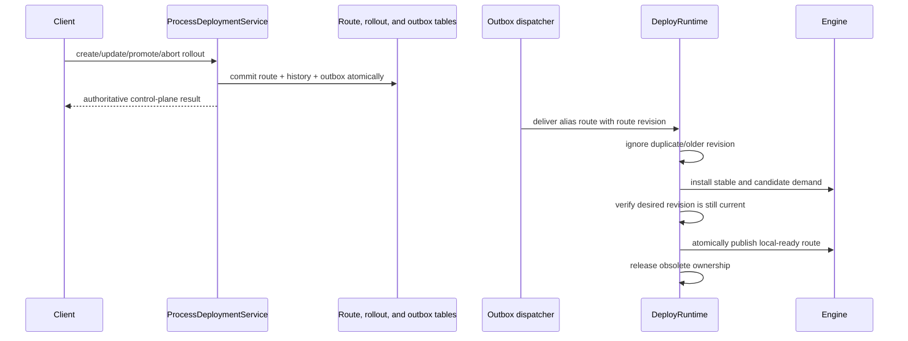

# CompileFlow Version Routing

> Prerequisites: [Architecture overview](00-OVERVIEW.en.md) and
> [Deploy protocol](../../compileflow-deploy/docs/PROTOCOL.md).

CompileFlow separates immutable flow versions, mutable Alias routes, rollout history, and node-local runtime
installation. Publishing a definition does not move traffic, and moving traffic does not rewrite a published artifact.

## 1. Identity And Authority

A published artifact is identified by `(namespace, code, version)`:

- `namespace` is a first-class logical resource scope. It is not an authorization boundary by itself.
- `code` is the stable flow identity.
- `version` is an immutable, non-reusable release identity.

Definition execution uses the fixed `default` scope.
Published-reference factories without an explicit namespace use the same default. Every API that accepts an explicit
namespace rejects null, blank, surrounding whitespace, and invalid
identifier characters; repositories, protocol adapters, and snapshots do not reinterpret invalid identity.

`cf_process_version` is the immutable source authority for each Version and stores model type, exact content, SHA-256
digest, metadata, actor, and database creation time. Model type belongs to that exact Version; CompileFlow does not add
a second process-level authority that permanently binds `(namespace, code)` to one format. Row existence is the
publication fact; there is no mutable preparation status. A V1 executable ProcessCall graph still uses one model type,
so a format change is expressed by publishing and routing to a different root Version rather than by mixing formats
inside one graph.
Publishing never compiles a node-local runtime or changes traffic.

`cf_process_alias` is the current route for `(namespace, code, alias)`. The product route supports one stable version
and, during a canary, one candidate version. Control-plane commands and the runtime canonical model both use basis
points (`1..9999`) so no protocol boundary performs a hidden unit conversion. `cf_rollout` and `cf_rollout_event` keep operation history;
neither is used as the execution-time route lookup.

## 2. Runtime Snapshots

`LocalRoutingState` owns exactly two node-local projections:

| Snapshot                  | Responsibility                                                  |
|---------------------------|-----------------------------------------------------------------|
| `LocalAliasRouteState`      | Stable/candidate alias route and revision observed by this node |
| `InstalledVersionState` | Versions successfully installed and executable on this node    |

Alias updates carry one positive route `revision`. Duplicate and older revisions are ignored. A tombstone retains the
revision high-watermark, so delayed delivery cannot resurrect a deleted route.

These projections are read-only caches, not authorities. They may be rebuilt from the route repository and delivery
channel. The default `LocalReadyAliasRouteSource` exposes the alias projection as serving-ready state; a database
transaction remains the control-plane source of truth.

## 3. Targeting And Selection Contract

An Alias route may explicitly bind one named `ProcessAliasTargetingPolicy`. The policy receives
the authoritative stable/candidate pair, immutable route parameters, and bounded request inputs. It may force only
`STABLE` or `CANDIDATE`, or return empty to delegate to standard percentage routing:

```java
public interface ProcessAliasTargetingPolicy {
    String name();
    Optional<ProcessAliasTarget> target(ProcessAliasTargetingContext context);
}
```

The context deliberately omits candidate weight, and the engine maps a target to an immutable authorized version.
Targeting therefore cannot redefine percentage semantics or invent a version. Percentage routing is fixed by the protocol.
There is no public percentage-selection SPI.

Exactly one `ProcessAliasRouteSource` supplies immutable, serving-ready `ProcessAliasRoute` values to an engine. The
source is configured explicitly and is not collected from plugins; multiple authorities and fallback chains are not
supported. The default source reads `LocalAliasRouteState` and, in embedded topology, may converge an unseen Alias once.

Core's `AliasAdmission` reads that source once and applies `AliasTargetSelector`: the explicitly named targeting policy
runs first, and an empty result falls through to `DeterministicAliasSelector`. It records the selected version, target,
and revision across multi-format dispatch. The
selected exact root runtime is retained before process code starts. Only when exact runtime acquisition misses during a
route handoff does the runtime provider re-read the source and retry the complete admission once. A successful handoff
pins that invocation even if a newer revision arrives. The fixed percentage selector:

1. Returns `STABLE` when there is no candidate; candidate selection requires the effective cohort key already supplied
   by the execution admission boundary.
2. Encodes `CFROUTE1`, namespace, process code, alias, candidate version, and the exact routing key as length-prefixed
   UTF-8 fields.
3. Computes SHA-256, interprets the first 64 bits as unsigned, and takes modulo 10,000.
4. Selects `CANDIDATE` when the bucket is below `candidateWeightBps`; otherwise it selects `STABLE`.

Including the candidate version in the hash reshuffles cohorts for a new rollout. The same inputs produce the same
target across threads, nodes, restarts, and conforming language implementations. There is no request-local random
fallback.

A published Alias request with no serving route fails closed. A route naming an unavailable policy never becomes locally
ready. Route-source failures still fail the invocation. A registered policy's runtime failure, including a null result,
selects the stable target and emits an error with `TARGETING_ERROR` attribution; it is never silently treated as standard
percentage routing. The bounded handoff retry never guesses a version; it evaluates one complete newer route.

Every selection has one bounded reason: `STABLE_ONLY`, `TARGETING`, `SPLIT`, or `TARGETING_ERROR`. Diagnostics may also
carry the configured policy name, but never request attributes or policy parameter values. Durable admission persists the
reason and optional policy name with the selected exact Version; raw evaluation context is not recovery state.

The optional routing key and custom policy attributes are supplied through `ProcessExecutionOptions`, not business
variables. When the key is absent, the execution occurrence identity supplies it: Sync, persisted Async, and Durable
admission use invocation ID, persisted invocation ID, and Process Run ID respectively:

```java
ProcessExecutionOptions options = ProcessExecutionOptions.builder()
        .aliasRouting(new AliasRoutingOptions("customer-7", Map.of("region", "eu-west")))
        .build();

engine.execute(
        ProcessRef.alias("default", "order.process", "production"),
        variables,
        options).orElseThrow();
```

`routingKey` is opaque: CompileFlow does not trim, parse, log, persist, expose, or insert it into process variables.
Attributes are request-only, untrusted, potentially sensitive selector input and are likewise never logged or persisted.
Reserved first-class fields and the complete `__cf_` namespace cannot be duplicated inside the custom attribute map.
The key is limited to 512 characters; the map to 32 entries; names to 128 characters; values to 2,048 characters;
and the complete routing input to 32 KiB of UTF-8 data.

The runtime provider has one resolution boundary:

1. `ProcessRef.Version` uses the explicitly requested immutable version.
2. `ProcessRef.Alias` resolves through the configured `ProcessAliasRouteSource`, optional route-bound targeting, and
   fixed percentage selection.
3. Every `ProcessDefinition` variant executes through its explicit source semantics without Alias routing.

There is no active-version lookup, previous-version fallback, or latest-version guess. In a deployment runtime, the
selected version must also be present in `InstalledVersionState`; otherwise execution fails closed.

## 4. Control-Plane Operations

`ProcessDeploymentService` exposes these operations:

| Operation                                         | Effect                                                                                              |
|---------------------------------------------------|-----------------------------------------------------------------------------------------------------|
| `publish(PublishProcessVersionCommand)`           | Validate and persist one immutable source identity; does not install runtime state or route traffic |
| `createRollout(CreateRolloutCommand)`             | Atomically create rollout history, mutate the route, and enqueue an outbox event                    |
| `updateCanaryWeight(UpdateCanaryWeightCommand)` | Change candidate weight in basis points using rollout and Alias revision checks                     |
| `promoteRollout(PromoteRolloutCommand)`           | Make the candidate the sole stable version and complete the rollout                                 |
| `abortRollout(AbortRolloutCommand)`               | Restore the canary's captured stable route and mark that rollout aborted                            |
| `rollbackRollout(RollbackRolloutCommand)`         | Create a new all-at-once rollout to a completed source rollout's captured baseline                  |

`ALL_AT_ONCE` creates a completed rollout. `CANARY` creates an `IN_PROGRESS` rollout and keeps both stable and candidate
versions demanded by runtime nodes.

Every rollout creation has an actor, operation kind, scoped idempotency key, and expected Alias revision; revision zero
means the Alias must not yet exist. The key scope includes namespace, process, Alias, and operation kind, while the
fingerprint covers the complete semantic request. Canary mutations use the rollout revision and also verify the Alias
they intend to change. A stale precondition fails instead of overwriting a concurrent actor.

Rolling back a completed deployment that still owns the expected Alias revision creates a new `ALL_AT_ONCE` rollout
targeting its captured baseline. It never mutates the completed historical record. Aborting an active canary is
different: it terminates that canary and restores its captured baseline.

## 5. Canary Example

```java
ProcessRef.Version version =
        ProcessRef.version("default", "order.process", "v2.0.0");
ProcessDefinition.Inline definition =
        ProcessDefinition.inline("order.process", xml);

deploymentService.publish(new PublishProcessVersionCommand(
        version, ProcessModelType.TBBPM, definition, "alice", metadata));

ProcessRollout canary = deploymentService.createRollout(CreateRolloutCommand.canary(
        "release-order-v2",
        ProcessRef.alias("default", "order.process", "production"),
        ProcessRef.version("default", "order.process", "v2.0.0"),
        currentAliasRevision,
        1_000,
        "alice",
        "ticket-4821"));

canary = deploymentService.updateCanaryWeight(new UpdateCanaryWeightCommand(
        canary.getId(), 5_000, canary.getRevision(), "alice"));

canary = deploymentService.promoteRollout(new PromoteRolloutCommand(
        canary.getId(), canary.getRevision(), "alice"));
```

Abort a regressing canary:

```java
deploymentService.abortRollout(new AbortRolloutCommand(
        canary.getId(), canary.getRevision(), "alice", "error rate exceeded policy"));
```

## 6. Commit And Runtime Convergence



A successful control-plane command means the authoritative transaction committed. It does not claim that every node has
converged. Delivery is at least once, and reconciliation republishes current authority when the channel drifts.

A node records the new desired route before installation finishes, but execution sees only its previous local-ready
route until every demanded runtime is installed and the desired revision is rechecked. A node with no prior local-ready
route fails closed. Installation failure keeps the previous local-ready route and is exposed through runtime
diagnostics; it never publishes a partial stable/candidate state. Outbox state, route-attributed execution logs, and
installation failures expose convergence separately from control-plane commit.

Publishing local-ready state transfers admission to the new route; it does not interrupt admitted work. Each versioned
invocation admits one exact root, then prepares the complete static call graph before running process code. Every
published call declares an exact child `version` in the parent source and inherits only the parent namespace; Alias
routing is root-only. The resolved graph retains every exact runtime needed by the invocation, so later Alias changes or
runtime-cache eviction cannot change an admitted frame. A missing or non-ready exact child fails with `CF_EXEC_012`; an
authority mismatch, identity mismatch, or cycle fails with `CF_EXEC_014` before the first action.

## 7. Observability And Canary Health

Alias-selected executions record:

- namespace and flow code;
- requested and effective versions;
- routing source;
- route alias;
- route revision.

The event snapshot is immutable before asynchronous listener dispatch. The server persists only these known routing
fields, not arbitrary application metadata.

Local canary health analysis uses only logs matching namespace, flow, and route alias, and only samples at or after the
rollout creation time. Unattributed executions are excluded from the result. The endpoint evaluates absolute error-rate
and latency thresholds but never mutates traffic; promotion and abort remain explicit operator commands. Relative or
external-metric analysis, automatic decisions, and scheduled steps require a separately designed policy, authority, and
coordinator.

## 8. Operational Checks

- Keep Alias names stable. Workbench suggests `dev`, `staging`, and `production`, but accepts any valid Process Alias.
- Supply a routing key when an identity must remain in one canary cohort.
- Treat route revision conflicts as a prompt to read current state, decide again, and retry.
- Monitor control-plane commit and runtime convergence separately.
- Inspect `DeployRuntime.snapshot()` for demanded, in-flight, deployed, and backed-off versions.
- Investigate execution logs by route alias and revision when validating a canary step.
- Never repair an incident by mutating a published version or bypassing rollout history.

## 9. Implementation References

- `compileflow-api/.../spi/routing/AliasTargeting.java`
- `compileflow-api/.../spi/routing/ProcessAliasTargetingPolicy.java`
- `compileflow-api/.../spi/routing/ProcessAliasTargetingContext.java`
- `compileflow-api/.../spi/routing/ProcessAliasRouteSource.java`
- `compileflow-api/.../spi/routing/ProcessAliasRoute.java`
- `compileflow-core/.../routing/AliasTargetSelector.java`
- `compileflow-core/.../routing/DeterministicAliasSelector.java`
- `compileflow-core/.../routing/AliasAdmission.java`
- `compileflow-core/.../routing/AliasSelection.java`
- `compileflow-core/.../routing/LocalAliasRouteState.java`
- `compileflow-core/.../routing/LocalReadyAliasRouteSource.java`
- `compileflow-core/.../runtime/resolution/ProcessRuntimeResolver.java`
- `compileflow-deploy/compileflow-deploy-api/.../api/ProcessDeploymentService.java`
- `compileflow-deploy/.../runtime/DeployRuntime.java`
- `compileflow-deploy/.../runtime/state/DeploymentSyncRoutingStateSubscriber.java`
- `compileflow-deploy/.../runtime/install/RuntimeInstaller.java`
