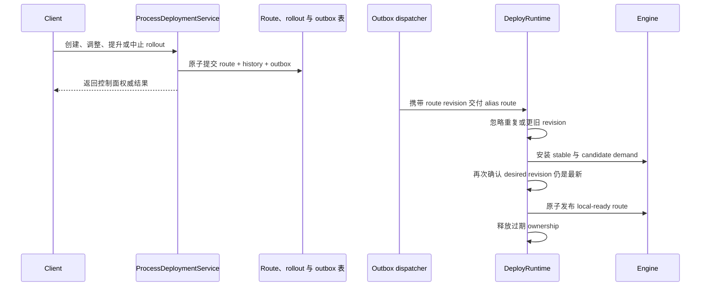

# CompileFlow 版本路由

> 前置阅读：[架构概览](00-OVERVIEW.zh.md)与
> [Deploy 协议](../../compileflow-deploy/docs/PROTOCOL.md)。

CompileFlow 将不可变流程版本、可变Alias 路由、发布操作历史和节点本地安装状态分开。发布代码不会自动切流，切流也不会重写已发布制品；这是主流
revision 平台共同采用的边界。

## 1. 身份与权威状态

已发布制品由 `(namespace, code, version)` 唯一标识：

- `namespace` 是一级逻辑资源作用域，但它本身不是授权边界。
- `code` 是稳定流程标识。
- `version` 是不可变且不可复用的发布标识。

Definition execution 使用固定 `default` 作用域；不显式接收
namespace 的已发布引用 factory 也使用同一默认值。所有显式接收 namespace 的 API 都拒绝
null、blank、首尾空白和非法标识符；repository、protocol adapter 与 snapshot 不会再次解释无效 identity。

`cf_process_version` 是每个 Version 的不可变源码权威，保存 model type、精确内容、SHA-256 digest、metadata、actor
和数据库创建时间。Model type 属于该 exact Version；CompileFlow 不再增加一层把 `(namespace, code)` 永久绑定到单一格式的
Process 级 authority。row 存在本身就是发布事实，不维护可变准备状态。V1 的一个可执行 ProcessCall graph 仍只使用一种
model type；格式迁移应发布并切换新的 root Version，而不是在同一执行图内混合格式。发布不编译节点本地 runtime，也不改变流量。

`cf_process_alias` 是 `(namespace, code, alias)` 的当前路由。产品路由支持一个稳定版本，以及灰度期间一个候选版本。控制面命令与
runtime 规范模型统一使用基点（`1..9999`），任何协议边界都不再执行隐藏的单位换算。
`cf_rollout` 与 `cf_rollout_event` 保存操作历史，不参与执行热路径查询。

## 2. 运行时快照

`LocalRoutingState` 只持有两类节点本地投影：

| 快照                      | 职责                                                      |
|---------------------------|-----------------------------------------------------------|
| `LocalAliasRouteState`      | 本节点已观察到的 stable/candidate alias route 与 revision |
| `InstalledVersionState` | 本节点已成功安装、可以执行的版本                         |

Alias 更新只使用一个正 route `revision`。重复或更旧 revision 会被忽略。Tombstone 保留 revision 高水位，因此延迟消息无法复活已删除路由。

这些投影是只读缓存，不是权威数据；它们可以由路由仓库和交付通道重建。默认的
`LocalReadyAliasRouteSource` 将 Alias 投影暴露为 serving-ready 状态，数据库事务仍是控制面事实来源。

## 3. Targeting 与选择契约

Alias route 可以显式绑定一个具名 `ProcessAliasTargetingPolicy`。Policy 接收权威 stable/candidate pair、
不可变 route 参数和有界请求输入，只能强制 `STABLE`、`CANDIDATE`，或返回 empty 进入标准百分比分桶：

```java
public interface ProcessAliasTargetingPolicy {
    String name();
    Optional<ProcessAliasTarget> target(ProcessAliasTargetingContext context);
}
```

Context 不暴露 candidate weight，Engine 负责将 target 映射为获授权的不可变版本，因此 targeting 既不能重定义百分比
语义，也不能构造任意版本。百分比分桶由协议固定，不存在公开的 percentage-selection SPI。

每个 Engine 只允许一个 `ProcessAliasRouteSource` 提供不可变、serving-ready 的 `ProcessAliasRoute`。Source 必须显式配置，
不从 plugin 聚合；不支持多权威或 fallback chain。默认 Source 读取 `LocalAliasRouteState`，并可在 embedded topology 中对从未见过的
Alias 做一次同步收敛。

Core 的 `AliasAdmission` 只读取 Source 一次并调用 `AliasTargetSelector`：先执行 route 显式指定的具名 targeting policy，
返回 empty 时进入 `DeterministicAliasSelector`。它把选中的 version、target
和 revision 传过多格式分发边界。流程代码开始前会 retain 所选精确根 runtime。只有 route handoff 期间精确 runtime 获取失败时，
Runtime provider 才会重读 Source 并完整 admission 一次；接管成功后，即使新 revision 到达，本次调用仍固定到已选版本。固定
百分比选择器：

1. 没有 candidate 时返回 `STABLE`；有 candidate 时要求 execution admission 边界已经提供有效 cohort key。
2. 将 `CFROUTE1`、namespace、process code、alias、candidate version 和 routing key 编码为带长度前缀的 UTF-8 字段。
3. 计算 SHA-256，将前 64 bit 解释为无符号数并对 10,000 取模。
4. Bucket 小于 `candidateWeightBps` 时选择 `CANDIDATE`，否则选择 `STABLE`。

Hash 输入包含 candidate version，因此新 rollout 会有意重排 cohort。相同输入在线程、节点、重启和符合规范的其他语言实现中得到相同
target；不存在请求级随机降级。

已发布 Alias 没有 serving route 时 fail-closed。Route 指定的 Policy 在节点上不可用时不能进入 local-ready；Route Source
异常仍会使调用失败。已注册 Policy 的运行时异常（包括返回 null）会选择 stable，并以 `TARGETING_ERROR` 归因记录错误，绝不
静默混入标准百分比分桶。有界 handoff 重试只评估更新后的完整 route，runtime 绝不猜测版本。

每次选择只有四种有界原因：`STABLE_ONLY`、`TARGETING`、`SPLIT`、`TARGETING_ERROR`。诊断可额外携带配置的 Policy
名称，但绝不携带请求 attributes 或 Policy 参数值。Durable admission 将原因和可选 Policy 名与选中的 exact Version 一起
记录；原始 evaluation context 不属于恢复状态。

可选 Routing key 与自定义策略属性通过 `ProcessExecutionOptions` 提供，不混入业务变量。未提供 key 时，由 execution
occurrence identity 补全：Sync、持久化 Async、Durable admission 分别使用 invocation ID、持久化 invocation ID 与
Process Run ID：

```java
ProcessExecutionOptions options = ProcessExecutionOptions.builder()
        .aliasRouting(new AliasRoutingOptions("customer-7", Map.of("region", "eu-west")))
        .build();

engine.execute(
        ProcessRef.alias("default", "order.process", "production"),
        variables,
        options).orElseThrow();
```

`routingKey` 是不透明值：CompileFlow 不 trim、解析、记录日志、持久化、返回给调用方，也不将其放入业务变量。Attributes 是
request-only、不可信且可能敏感的 selector input，同样不记录、不持久化。自定义属性 map 不能重复
alias、version、namespace、processCode、routingKey 等一等字段，也不能占用完整的 `__cf_` 名称空间。key 最长 512
字符；map 最多 32 项；name 最长 128 字符；value 最长 2,048 字符；全部路由输入的 UTF-8 总量不超过 32 KiB。

Runtime provider 只有一个版本解析边界：

1. `ProcessRef.Version` 使用显式请求的不可变版本。
2. `ProcessRef.Alias` 由已配置的 `ProcessAliasRouteSource`、可选 route-bound targeting 与固定百分比分桶解析。
3. 所有 `ProcessDefinition` 变体都按各自显式 source 语义执行，不经过 Alias 路由。

不存在 active-version 查询、previous-version 降级或 latest-version 猜测。使用 `DeployRuntime` 时，所选版本还必须存在于
`InstalledVersionState`，否则执行 fail-closed。

## 4. 控制面操作

`ProcessDeploymentService` 提供以下操作：

| 操作                                              | 效果                                                                   |
|---------------------------------------------------|------------------------------------------------------------------------|
| `publish(PublishProcessVersionCommand)`           | 校验并持久化一个不可变源码 identity；不安装 runtime，也不切流          |
| `createRollout(CreateRolloutCommand)`             | 原子创建 rollout 历史、修改路由并写入 outbox                           |
| `updateCanaryWeight(UpdateCanaryWeightCommand)` | 通过 rollout 与 Alias revision 检查修改以基点表示的候选流量权重          |
| `promoteRollout(PromoteRolloutCommand)`           | 将候选版本提升为唯一稳定版本并完成 rollout                             |
| `abortRollout(AbortRolloutCommand)`               | 恢复灰度创建时捕获的稳定路由，并将该 rollout 标记为 aborted            |
| `rollbackRollout(RollbackRolloutCommand)`         | 创建指向已完成 source rollout 所捕获 baseline 的新 all-at-once rollout |

`ALL_AT_ONCE` 创建后立即成为完成态；`CANARY` 创建 `IN_PROGRESS` rollout，运行时同时 demand 稳定与候选版本。

每次创建 rollout 都必须携带 actor、operation kind、scoped idempotency key 和 expected Alias revision；revision 为零表示
Alias 必须不存在。key scope 包含 namespace、process、Alias 和 operation kind，fingerprint 覆盖完整语义请求。灰度变更使用
rollout revision，并校验待修改 Alias 仍与预期一致。过期前置条件会失败，不会覆盖并发 actor。

只有仍拥有 expected Alias revision 的已完成 rollout 才能作为回滚 source；回滚会创建一个新的
`ALL_AT_ONCE` rollout，目标指向 source 捕获的 baseline，原历史记录不变。中止正在进行的灰度则不同：它终止该灰度并恢复其捕获的
baseline。

## 5. 灰度示例

```java
ProcessRef.Version version =
        ProcessRef.version("default", "order.process", "v2.0.0");
ProcessDefinition.Inline definition =
        ProcessDefinition.inline("order.process", xml);

deploymentService.publish(new PublishProcessVersionCommand(
        version, ProcessModelType.TBBPM, definition, "alice", metadata));

ProcessRollout canary = deploymentService.createRollout(CreateRolloutCommand.canary(
        "release-order-v2",
        ProcessRef.alias("default", "order.process", "production"),
        ProcessRef.version("default", "order.process", "v2.0.0"),
        currentAliasRevision,
        1_000,
        "alice",
        "ticket-4821"));

canary = deploymentService.updateCanaryWeight(new UpdateCanaryWeightCommand(
        canary.getId(), 5_000, canary.getRevision(), "alice"));

canary = deploymentService.promoteRollout(new PromoteRolloutCommand(
        canary.getId(), canary.getRevision(), "alice"));
```

灰度指标退化时中止：

```java
deploymentService.abortRollout(new AbortRolloutCommand(
        canary.getId(), canary.getRevision(), "alice", "error rate exceeded policy"));
```

## 6. 事务提交与运行时收敛



控制面命令成功只表示权威事务已经提交，不代表所有节点已经收敛。交付至少一次；通道漂移时，reconciliation 从当前权威状态重新发布。

节点会先记录新的 desired route，但在所有 demand runtime 安装成功并重新确认 desired revision 前，执行面只看到之前的
local-ready route。没有旧 local-ready route 的节点会 fail-closed。安装失败会保留旧 local-ready route，并通过 runtime
diagnostics 暴露，不会发布半完成的 stable/candidate 状态。Outbox 状态、带路由归因的执行日志和安装失败将收敛过程与控制面提交分别呈现。

发布 local-ready 状态只把新请求准入切到新路由，不会中断已经准入的工作。每个 versioned 调用先准入一个 exact root，再在业务代码
开始前准备完整静态调用图。每个 Published call 都在 Parent source 中声明 exact child `version`，并且只继承 Parent namespace；Alias
只用于 Root routing。准备完成的图持有本次调用需要的所有 exact runtime，因此后续 Alias 变化或 runtime-cache eviction 都不会改变已准入
frame。exact child 缺失或未 ready 时以 `CF_EXEC_012` fail-closed；authority mismatch、identity mismatch 或 cycle 在第一个 action
前以 `CF_EXEC_014` 失败。

## 7. 可观测性与灰度健康

Alias 路由执行会记录：

- namespace 与 flow code；
- requested/effective version；
- routing source；
- route alias；
- route revision。

事件在异步 listener 分发前冻结为不可变快照。Server 只持久化这些已知路由字段，不保存任意应用 metadata。

本地灰度健康分析只使用 namespace、flow、route alias 匹配，且时间不早于 rollout 创建时刻的日志。没有归因的
执行不会进入评估结果。接口只评估绝对错误率和延迟阈值，不会修改流量；提升和中止仍由操作人显式执行。相对
基线、外部指标、自动决策和定时步骤需要单独设计 policy、authority 与 coordinator。

## 8. 运维检查

- 保持 Alias 名称稳定。Workbench 建议 `dev`、`staging` 和 `production`，但接受任意合法 Process Alias。
- 同一身份必须保持灰度 cohort 时提供 routing key。
- Route revision 冲突后先读取当前状态，再明确重试。
- 分别监控控制面提交与 runtime 收敛。
- 通过 `DeployRuntime.snapshot()` 检查 demanded、in-flight、deployed 与 backed-off 版本。
- 验证灰度步骤时按 route alias 和 revision 检索执行日志。
- 不要通过修改已发布版本或绕过 rollout 历史来处理事故。

## 9. 实现引用

- `compileflow-api/.../spi/routing/AliasTargeting.java`
- `compileflow-api/.../spi/routing/ProcessAliasTargetingPolicy.java`
- `compileflow-api/.../spi/routing/ProcessAliasTargetingContext.java`
- `compileflow-api/.../spi/routing/ProcessAliasRouteSource.java`
- `compileflow-api/.../spi/routing/ProcessAliasRoute.java`
- `compileflow-core/.../routing/AliasTargetSelector.java`
- `compileflow-core/.../routing/DeterministicAliasSelector.java`
- `compileflow-core/.../routing/AliasAdmission.java`
- `compileflow-core/.../routing/AliasSelection.java`
- `compileflow-core/.../routing/LocalAliasRouteState.java`
- `compileflow-core/.../routing/LocalReadyAliasRouteSource.java`
- `compileflow-core/.../runtime/resolution/ProcessRuntimeResolver.java`
- `compileflow-deploy/compileflow-deploy-api/.../api/ProcessDeploymentService.java`
- `compileflow-deploy/.../runtime/DeployRuntime.java`
- `compileflow-deploy/.../runtime/state/DeploymentSyncRoutingStateSubscriber.java`
- `compileflow-deploy/.../runtime/install/RuntimeInstaller.java`
