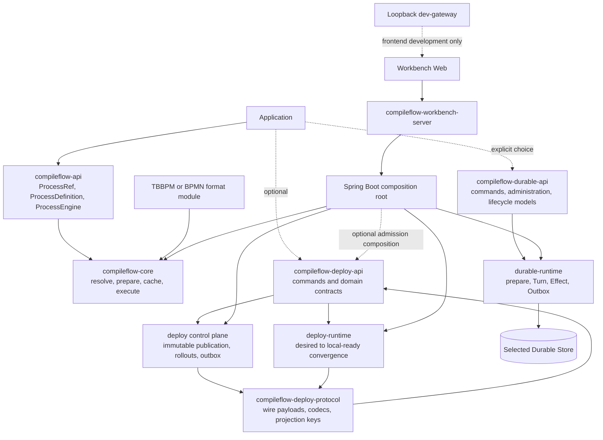

# CompileFlow architecture overview

CompileFlow is a multi-frontend, compile-then-execute process engine. Optional products add hot deployment, persisted
Durable execution, and the browser-based Workbench. This page provides the high-level map; the linked documents define
each contract in detail.

## Product Shape



The reusable engine path is `compileflow-api` plus one format module. Deployment, Server, and Workbench are optional
product layers, not prerequisites for in-process execution.

## Core Execution

The public boundary separates definition sources from published references:

- `ProcessDefinition` supplies or locates a definition through `Inline` or `Classpath`.
- `ProcessRef.Version` selects one exact immutable version.
- `ProcessRef.Alias` selects one published route.

```java
ProcessDefinition definition =
        ProcessDefinition.classpath(ProcessModelType.TBBPM, "order.process", "flows/order.bpm");
ProcessResult<Map<String, Object>> result =
        engine.execute(definition, Map.of("orderId", "A-42"));
```

The default `COMPILED` execution pipeline is:

```text
request
  -> resolve one bounded byte snapshot
  -> validate and parse
  -> generate Java
  -> compile once per exact local ProcessRuntimeIdentity
  -> cache and retain
  -> execute
  -> return typed outcome and execution details
```

`INTERPRETED` realizes the same semantic plan without generating a process class; registered scripts still have their
own preparation requirements.

`ProcessRuntimeIdentity` is engine-local and includes exact source digest, model type, compilation-pipeline identity, and
class-loader identity. It is not a portable compiled-artifact ID and is never persisted.

## Routing And Deployment

A published version is immutable. An Alias contains one stable version and at most one candidate with a basis-point
weight. Alias revision is the sole ordering field.

The control plane commits route, rollout history, and outbox state atomically. Publication is a separate operation and
never changes traffic or installs a local runtime.

Each runtime node keeps two facts:

- **desired**: newest authoritative Alias state received from storage or transport;
- **local-ready**: newest route whose stable and candidate runtimes are all retained locally.

The node publishes a local-ready route only after all required runtimes are installed and the desired revision is
rechecked. Installation failure keeps the previous local-ready route. Execution fails closed when no valid local-ready
route exists; it never falls back to an older version behind the committed route.

## Durable Execution

Durable is an explicit product surface, separate from the `ProcessEngine` and the Workbench whole-invocation
asynchronous queue. Start accepts an explicit Definition, exact Version, or Alias. An outer composition resolves Alias
exactly once during admission; all three paths materialize immutable stored Process semantics and bind the Run to its
exact Process ID. Version may remain admission attribution, but recovery never routes through Version or Alias. The
Kernel persists the Process Definition, portable continuation snapshots, and committed execution facts. Generated
programs, bytecode, derived schemas, and configured application providers are disposable runtime material. Each bounded
Machine Turn commits the complete next continuation, exact occurrence consumption, new occurrence requests, and
disposition atomically to the selected Store.

The execution plane claims Run, Effect, and Outbox work through revisioned token leases. Maintenance handles expired
leases, Timers, cancellation, and bounded Outbox recovery. Application/provider/runtime compatibility and
infrastructure automation remain outside the kernel.

See the [Durable Architecture](durable-architecture.md) for the complete component, state, transaction, security,
and maintenance model.

## Extension Model

Providers and plugins are resolved while building `ProcessEngineConfig`. The validated result is immutable for the
lifetime of every engine created from that configuration. Registration and precedence rules are documented in
the [Extension Guide](../extension-guide.md).

## Configuration

Each product parses configuration at its own boundary and passes immutable values to runtime components. The complete
application and Spring property reference, including Provider-specific and Durable settings, is in the
[configuration guide](../configuration.md). Spring's datasource, server, management, and logging settings remain under
their standard prefixes.

## Supported Runtime Baseline

CompileFlow publishes Java 17 bytecode and supports patched Java 17, 21, and 25 LTS runtimes. Generated-flow source and
bytecode also target Java 17. Java 21 and 25 can use virtual threads through the internal executor strategy; the public
API is identical on every supported JDK.

## Design Properties

- One canonical `Map<String, Object>` execution pipeline; typed DTO methods are adapters.
- Exact bytes determine source identity.
- Runtime caches are bounded, single-flight, retain-aware, and owned by an Engine.
- Routing keys stay on the request-to-policy path.
- Control-plane commit and node convergence are different observable milestones.
- Rollback creates a new rollout; history is never rewritten.
- Defaults use bounded-cardinality metrics; detailed business identity belongs in diagnostics, structured logs, and
  traces.

## Continue Reading

- [Module Map](module-map.md)
- [Durable Architecture](durable-architecture.md)
- [Supported Surfaces](supported-surfaces.md)
- [Hot Deployment](../hot-deploy.md)
- [Extension Guide](../extension-guide.md)
