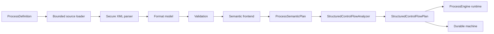

# Process model architecture

TBBPM and BPMN definitions share one format-neutral semantic and execution model. The format specifications define syntax; this page defines the ownership boundaries and invariants that make a definition executable.

## Authority and ownership

| Question                            | Authority                                                                                                |
| ----------------------------------- | -------------------------------------------------------------------------------------------------------- |
| TBBPM syntax and semantics          | [TBBPM specification](../specifications/tbbpm.md) and `TBBPM.xsd`                                        |
| BPMN extension syntax and semantics | [BPMN extension specification](../specifications/bpmn-extensions.md) and `CompileFlowBpmnExtensions.xsd` |
| Supported nodes                     | [Node support](../node-support.md)                                                                       |
| Format correspondence               | [Process format reference](../specifications/process-formats.md)                                         |
| Parser/writer registration parity   | `scripts/check_spec_impl_parity.py`                                                                      |

`compileflow-tbbpm` and `compileflow-bpmn` own their source models, parsers, validators, semantic frontends, and
semantic-compiler providers. `compileflow-core` owns engine bootstrap, source loading, semantic plans, control-flow
analysis, Java generation, and execution. Format implementation classes are not application contracts.

## Compilation pipeline

Preflight, warm-up, source generation, and first execution use the same interpretation of a definition. They stop at different stages. Generated classes and bytecode are cache artifacts owned by the engine and are not application APIs.

## Format boundary

TBBPM is CompileFlow's native compact format. BPMN accepts the documented executable subset of BPMN 2.0; standard elements keep their BPMN meaning and CompileFlow-specific data uses the `cf:` namespace. General BPMN validity does not imply CompileFlow executability. Unsupported collaboration, compensation, human-workflow, or other out-of-profile elements fail validation instead of being ignored.

Both formats use the same Action policy contract: `maxAttempts` is an integer, `1..100`; `backoffMultiplier` is a finite double, `>= 1.0`; duration-valued settings use whole-millisecond ISO-8601 durations; an Action has at most one policy element; and Timeout cancellation is cooperative. JVM fatal errors (`Error`) are never retried. Durable `replayable` and `effect` semantics are a separate Action-level contract.

## Structured control flow

CompileFlow lowers a graph into structured Java rather than interpreting an arbitrary token graph. A gateway with one incoming and multiple outgoing transitions is a split; multiple incoming and one outgoing is a join. A gateway with both multiple incoming and multiple outgoing transitions is rejected; model a join followed by a split. Branching from a non-gateway node is rejected.

Parallel and inclusive splits must converge at a matching gateway type unless the process terminates. The analyzer uses dominance and post-dominance to identify branch regions and emits shared continuation once. Unreachable nodes, cross-container edges, ambiguous joins, overlapping regions, and unsupported nested concurrent regions fail preflight.

## Execution semantics

The immutable semantic and structured plans are consumed by the compiled, interpreted, and Durable realizations.
Exclusive gateways select one branch. Parallel and inclusive gateways use the documented branch coordination and merge
rules; generated branch frames prevent concurrent branches from writing through one shared generated object.

Durable persists the exact source bytes and model type so recovery can select the correct semantic frontend, but its
machine, continuation, Turn, Wait, Timer, and Effect semantics depend only on the normalized plans. Production Durable
code must not depend on TBBPM or BPMN implementation packages, and Durable lowering must not branch on model type.
Conversely, a source frontend must not depend on Durable. Each source format supplies one frontend to the shared
semantic model, independent of the selected execution surface or Store Provider.

Root execution accepts only a closed partial map of declared `param` variables. Process-owned `return` and `inner` variables are not caller input. A trigger entry starts a new downstream invocation from declared state; Durable continuation resumes the committed semantic checkpoint instead.

## Implementation invariants

Every supported process-model element has aligned schema, model, parser, validator, applicable writer and runtime
implementation, valid and invalid topology tests, and bilingual documentation. Parser-only elements, silently ignored
attributes, and generator branches that bypass semantic-plan ownership are outside the supported model.

## Related documents

- [Execution flow](execution-flow.md)
- [Supported surfaces](supported-surfaces.md)
- [Extension guide](../extension-guide.md)
