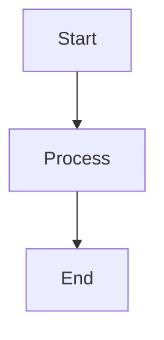

# CompileFlow 流程图示例

该目录保存用于说明控制流结构的 Mermaid 图。它们不是 TBBPM 或 BPMN 流程定义，也不作为解析、代码生成或运行时测试证据。

## 图例

| 文件                                | 内容           |
|-------------------------------------|----------------|
| `sampleBranchMerge.mermaid`         | 简单分支与合并 |
| `complexBranchMerge.mermaid`        | 多分支合并     |
| `simple4LevelGateway.mermaid`       | 四层顺序网关   |
| `nested4LevelGateway.mermaid`       | 四层嵌套网关   |
| `ultraComplexStructureFlow.mermaid` | 组合控制流示意 |

可在 [Mermaid Live Editor](https://mermaid.live) 中查看，或嵌入支持 Mermaid 的 Markdown：

````markdown

````

需要生成静态图片时，从仓库根目录运行：

```bash
pnpm dlx @mermaid-js/mermaid-cli \
  -i docs/examples/flow-diagrams/sampleBranchMerge.mermaid \
  -o sampleBranchMerge.svg
```

可执行语义以 TBBPM/BPMN 规范、Schema、实现和测试为准。新增图例时，不要把 Mermaid 节点名称或连线当作 CompileFlow 支持能力的声明。
