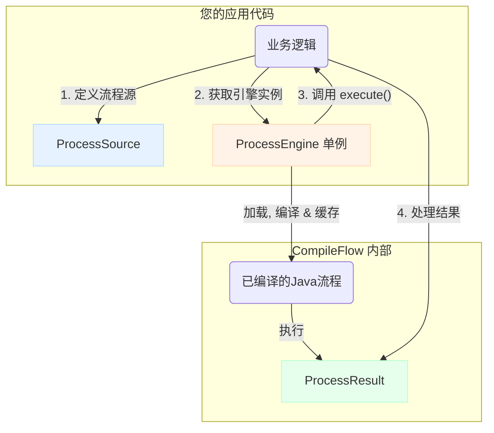

<div align="center">
  
</div>

# CompileFlow

**🚀 高性能编译式流程引擎**

*将业务流程转换为优化的Java代码，实现极致性能*

[](https://github.com/alibaba/compileflow/actions/workflows/ci.yaml)
[](https://search.maven.org/artifact/com.alibaba.compileflow/compileflow)
[](https://openjdk.java.net/)
[](https://www.apache.org/licenses/LICENSE-2.0.html)

[](https://github.com/alibaba/compileflow/stargazers)
[](https://github.com/alibaba/compileflow/fork)

[🇺🇸 English](../../README.md) | [🇨🇳 中文](README.md)

## ✨ CompileFlow 是什么？

CompileFlow是一款非常轻量、高性能、可集成、可扩展的流程引擎。

CompileFlow Process引擎是淘宝工作流TBBPM引擎之一，专注于纯内存执行、无状态。它通过将流程文件转换生成Java代码编译执行，运行效率极高。当前是阿里业务中台、交易等多个核心系统的流程引擎。

CompileFlow能让开发人员通过流程编辑器设计自己的业务流程，将复杂的业务逻辑可视化，为业务设计人员与开发工程师架起了一座桥梁，让业务表达更直观、更高效。

### 🎯 核心优势

- **⚡ 超高性能** - “编译执行”架构，提供原生Java代码的极致性能
- **🔒 类型安全** - 编译期校验，强类型约束
- **🔧 生产级** - Spring Boot无缝集成，提供监控和企业级特性
- **📊 多标准支持** - 支持BPMN 2.0和TBBPM两种流程规范
- **🎨 可视化设计** - 提供IntelliJ IDEA插件，支持可视化流程建模

---

## 核心概念

CompileFlow 的工作流程非常直观。您的业务代码通过 `ProcessEngine` 来执行一个由 `ProcessSource` 定义的流程，并获得一个
`ProcessResult`。



理解这 3 个核心API是上手CompileFlow的关键：

| API                | 描述                                                                                     |
|--------------------|----------------------------------------------------------------------------------------|
| `ProcessEngine`    | **流程引擎**: 核心入口，用于执行流程。它是一个重量级、线程安全的对象，**必须以单例模式使用**。                                   |
| `ProcessSource`    | **流程源**: 定义要执行哪个流程。你可以通过唯一编码(`fromCode`)、文件路径(`fromFile`)或直接提供XML内容(`fromContent`)来指定。 |
| `ProcessResult<T>` | **流程结果**: 执行的输出包装器。它包含执行是否成功、返回数据以及错误信息。                                               |

---

## 🚀 快速开始

在2分钟内启动并运行CompileFlow。

### A) 使用 Spring Boot (推荐)

这是在生产环境中使用CompileFlow最简单、最推荐的方式。

#### 1️⃣ 添加依赖

```xml

<dependency>
    <groupId>com.alibaba.compileflow</groupId>
    <artifactId>compileflow-spring-boot-starter</artifactId>
    <version>2.0.0-SNAPSHOT</version>
</dependency>
```

#### 2️⃣ 注入并执行流程

`ProcessEngine` 会被自动配置为单例，您可以直接注入使用。

```java

@Service
public class BusinessService {

    @Autowired
    private ProcessEngine<TbbpmModel> processEngine;

    public MyResponse executeProcess(MyRequest request) {
        ProcessSource processSource = ProcessSource.fromCode("my.business.process");

        ProcessResult<MyResponse> result = processEngine.execute(
            processSource,
            request,
            MyResponse.class
        );

        return result.orElseThrow(() -> new RuntimeException(result.getErrorMessage()));
    }
}
```

### B) 独立使用 (非Spring环境)

您也可以在任何Java应用中轻松使用CompileFlow。推荐的方式是手动实现单例模式。

#### 1️⃣ 添加依赖

```xml

<dependency>
    <groupId>com.alibaba.compileflow</groupId>
    <artifactId>compileflow-core</artifactId>
    <version>2.0.0-SNAPSHOT</version>
</dependency>
    <!-- 根据你的流程规范，添加 compileflow-tbbpm 或 compileflow-bpmn -->
<dependency>
<groupId>com.alibaba.compileflow</groupId>
<artifactId>compileflow-tbbpm</artifactId>
<version>2.0.0-SNAPSHOT</version>
</dependency>
```

#### 2️⃣ 创建单例引擎并执行

对于长生命周期的应用（如Web服务），你应该创建一个`ProcessEngine`的单例实例，在应用启动时初始化，在应用关闭时销毁。

```java
// ProcessEngineHolder.java
public final class ProcessEngineHolder {
    private static final ProcessEngine<TbbpmModel> INSTANCE = ProcessEngineFactory.createTbbpm();

    private ProcessEngineHolder() {
    }

    public static ProcessEngine<TbbpmModel> getInstance() {
        return INSTANCE;
    }

    // 在你的应用关闭钩子中调用此方法
    public static void shutdown() {
        if (INSTANCE != null) {
            INSTANCE.close();
        }
    }
}

// YourApplication.java
public class YourApplication {
    public static void main(String[] args) {
        ProcessEngineHolder.getInstance().admin().deploy(ProcessSource.fromCode("..."));

        ProcessEngine<TbbpmModel> engine = ProcessEngineHolder.getInstance();
        engine.execute(...);

        Runtime.getRuntime().addShutdownHook(new Thread(ProcessEngineHolder::shutdown));
    }
}
```

#### 备选方案: Try-with-resources (仅适用于短时任务)

对于简单的脚本或一次性任务，`try-with-resources`可以确保资源被自动关闭，非常方便。

```java
public class StandaloneScript {
    public static void main(String[] args) {
        try (ProcessEngine<TbbpmModel> processEngine = ProcessEngineFactory.createTbbpm()) {
            // ... 执行流程 ...
        }
    }
}
```

> ⚠️ **重要**: 切勿在长生命周期的应用（如Web服务）的每个请求中都使用`try-with-resources`创建新引擎，这会导致严重的性能问题。请务必使用单例模式。

---

## 核心API概览

### `ProcessEngine`: 执行流程

```java
//----------- 执行无状态流程 (最常用) -----------
ProcessResult<MyResponse> result = engine.execute(source, request, MyResponse.class);
ProcessResult<Map<String, Object>> result = engine.execute(source, context);

//----------- 触发有状态流程 -----------
engine.

trigger(source, "some-node-tag","some-event",payload);
```

### `ProcessSource`: 指定流程来源

```java
// 按唯一编码 (推荐, 通常用于classpath下的流程)
ProcessSource.fromCode("bpm.ktv.ktvExample");

// 按文件路径
ProcessSource.

fromFile("bpm.ktv.ktvExample","/path/to/your/flow.bpm");

// 按Classpath路径
ProcessSource.

fromClasspath("bpm.ktv.ktvExample","bpm/ktv/ktvExample.bpm");

// 直接提供XML内容 (用于动态加载)
ProcessSource.

fromContent("bpm.ktv.ktvExample","<bpm>...</bpm>");
```

### `ProcessAdminService`: 管理流程

```java
// 获取管理服务
ProcessAdminService admin = engine.admin();

// 预热/部署流程 (在应用启动时调用，以消除首次执行的编译延迟)
admin.

deploy(
    ProcessSource.fromCode("bpm.order.process"),
    ProcessSource.

fromCode("bpm.payment.process")
);
```

## 📚 详细文档

| 文档                                | 描述                        |
|-----------------------------------|---------------------------|
| [🚀 快速开始指南](quick-start.md)       | 5 分钟上手完整示例                |
| [⚠️ 资源管理](resource-management.md) | **必读!** 如何正确使用引擎单例，避免资源泄漏 |
| [⚙️ 配置指南](configuration.md)       | 查看所有YAML和编程式配置选项          |
| [API 参考](api-reference.md)        | 所有公共API的详细参考              |
| [🔥 热部署](hot-deploy.md)           | 生产环境中的零停机流程更新策略           |
| [📊 监控 & 可观测性](monitoring.md)     | 集成事件、指标和Prometheus        |
| [✨ 高级特性](advanced-features.md)    | 引擎预热、自定义ClassLoader等      |
| [🔧 扩展指南](extension-guide.md)     | 开发自定义扩展 (SPI)             |
| [📋 节点支持列表](node-support.md)      | TBBPM 和 BPMN 2.0 的节点支持详情  |
| [🛠️ 贡献指南](contributing.md)       | 如何为项目贡献代码和文档              |

## 🤝 社区

- 💬 **[GitHub Discussions](https://github.com/alibaba/compileflow/discussions)** - 提问和分享想法
- 🐛 **[Issue Tracker](https://github.com/alibaba/compileflow/issues)** - 报告 bug 和功能请求
- 📧 **[安全问题](../../SECURITY.md)** - 报告安全漏洞

---

<div align="center">

## 📜 许可证

CompileFlow 基于 [Apache License 2.0](../../LICENSE) 获得许可

**⭐ 如果 CompileFlow 对您有帮助，请给我们一颗星! ⭐**

</div>
