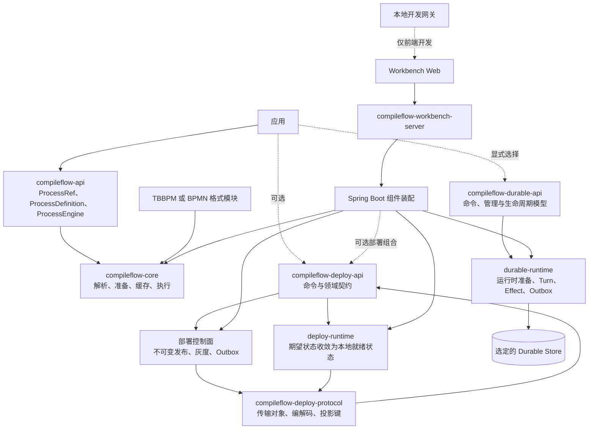

# CompileFlow 架构概览

CompileFlow 支持 TBBPM 和 BPMN 两种流程格式，默认采用编译执行模式。按需引入的模块还提供热部署、Durable 持久化执行和浏览器端
Workbench。本文介绍整体架构，具体契约以对应文档为准。

## 产品结构



在应用进程内使用引擎时，只需引入 `compileflow-api` 和一个格式模块。Deploy、Server 与 Workbench 均为可选能力。

## 核心执行

公共 API 将直接提供的流程定义与已发布流程引用分开：

- `ProcessDefinition` 通过 `Inline` 或 `Classpath` 提供或定位定义。
- `ProcessRef.Version` 指向一个精确且不可变的版本。
- `ProcessRef.Alias` 指向一个已发布的别名路由。

```java
ProcessDefinition definition =
        ProcessDefinition.classpath(ProcessModelType.TBBPM, "order.process", "flows/order.bpm");
ProcessResult<Map<String, Object>> result =
        engine.execute(definition, Map.of("orderId", "A-42"));
```

默认 `COMPILED` 模式的执行管线为：

```text
request
  -> 限量读取一份字节快照
  -> 解析并校验
  -> 生成 Java
  -> 按精确的本地 ProcessRuntimeIdentity 编译一次
  -> 缓存并保留
  -> 执行
  -> 返回类型化结果和执行信息
```

`INTERPRETED` 模式直接解释同一份语义计划，不生成流程类；已注册脚本仍需完成各自的准备工作。

`ProcessRuntimeIdentity` 是引擎本地标识，由流程定义摘要、模型类型、编译管线标识和类加载器标识共同确定。
它不是可移植的编译产物 ID，也不会被持久化。

## 路由与部署

已发布版本不可变。每个别名包含一个稳定版本，以及至多一个按基点设置权重的候选版本；别名修订号是唯一的顺序依据。

控制面以原子事务提交路由、灰度记录和 Outbox。发布版本是独立操作，不会切换流量或安装本地运行时。

每个运行时节点维护两种状态：

- **期望状态（desired）**：从存储或传输通道收到的最新权威别名状态；
- **本地就绪状态（local-ready）**：稳定版本和候选版本均已在本地准备就绪的最新路由。

节点只有在安装所有必要运行时并再次确认期望修订号后，才会发布本地就绪路由。安装失败时保留原路由；没有有效的本地就绪路由时，
执行请求直接失败，不会擅自选择已提交路由之外的版本。

## Durable 执行

Durable 是独立的持久化执行入口，与普通 `ProcessEngine` 及 Workbench 的整次调用异步队列互不混用。启动 Run 时可以传入显式定义、
精确版本或别名；别名只在启动时解析一次。三种方式都会保存不可变的流程定义，并将 Run 绑定到精确的 Process ID。版本可以作为启动来源保留，
但恢复时不会重新按版本或别名路由。Kernel 持久化流程定义、可移植的后续执行位置和已提交的执行事实；生成的程序、字节码、派生 Schema
以及应用提供的实现都可以重新生成或装配。每个有限的 Turn 都会在选定的 Store 中原子提交完整的后续执行位置、已消费事件、新请求和最终状态。

执行组件通过带修订号和随机令牌的租约领取 Run、Effect 与 Outbox 任务；维护组件负责处理过期租约、Timer、取消和有界的 Outbox 恢复。
应用实现、Provider、运行环境兼容性及基础设施自动化不属于 Kernel 的职责。

完整的组件、状态、事务、安全与维护模型见
[Durable 架构](durable-architecture.md)。

## 扩展模型

构建 `ProcessEngineConfig` 时会解析 Provider 和插件。配置校验完成后保持不变，并由据此创建的引擎共享。
注册方式和优先级见[扩展指南](../extension-guide.md)。

## 配置

各模块在自身边界解析配置，再将不可变配置传给运行时组件。完整的应用配置和 Spring 属性说明（包括 Provider 和 Durable
配置）见[配置指南](../configuration.md)。Spring 的数据源、服务、管理和日志配置继续使用标准属性前缀。

## 支持的运行时基线

CompileFlow 发布 Java 17 bytecode，支持安装最新安全更新的 Java 17、21、25 LTS 运行时。生成流程源码与 bytecode 同样固定为 Java
17。Java 21/25 可通过内部 executor 策略使用虚拟线程；所有支持 JDK 的公共 API 完全一致。

## 设计性质

- 唯一规范执行模型是 `Map<String, Object>`；typed DTO 方法只是适配器。
- 流程定义的原始字节决定其内容身份。
- 运行时缓存容量有上限；同一身份只会并发加载一次，并按引用关系保留，由引擎统一管理。
- 路由键只参与请求的路由策略选择。
- 控制面提交与节点收敛是两个独立可观测里程碑。
- 回滚会创建新的灰度记录，不会改写既有记录。
- 默认指标控制标签基数；详细业务信息仅进入诊断、结构化日志和链路追踪。

## 继续阅读

- [模块地图](module-map.md)
- [Durable 架构](durable-architecture.md)
- [支持面](supported-surfaces.md)
- [热部署](../hot-deploy.md)
- [扩展指南](../extension-guide.md)
