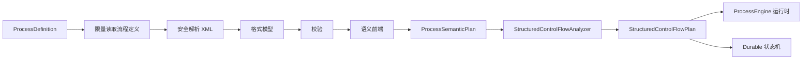

# 流程模型架构

TBBPM 和 BPMN 共用一套与格式无关的语义模型和执行模型。格式规范负责定义语法，本文说明从流程定义到可执行模型之间的职责边界和约束。

## 规范与职责

| 内容                       | 规范来源                                                                                |
| -------------------------- | --------------------------------------------------------------------------------------- |
| TBBPM 语法和语义           | [TBBPM 规范](../specifications/tbbpm.md)和 `TBBPM.xsd`                                  |
| BPMN 扩展语法和语义        | [BPMN 扩展规范](../specifications/bpmn-extensions.md)和 `CompileFlowBpmnExtensions.xsd` |
| 支持的节点                 | [节点支持列表](../node-support.md)                                                      |
| 两种格式的对应关系         | [流程格式参考](../specifications/process-formats.md)                                    |
| 解析器与写出器的注册一致性 | `scripts/check_spec_impl_parity.py`                                                     |

`compileflow-tbbpm` 和 `compileflow-bpmn` 分别负责各自的源模型、解析、校验、语义前端以及 `ProcessSemanticCompilerProvider` 实现。`compileflow-core` 负责引擎启动、流程定义加载、语义计划、控制流分析、Java 代码生成和执行。各格式的内部实现类不属于应用接口。

## 编译流程

流程预检、预热、源码生成和首次执行使用同一套解析与校验逻辑，只是停止在不同阶段。生成的类和字节码是引擎管理的缓存，不属于应用 API。

## 格式边界

TBBPM 是 CompileFlow 的原生紧凑格式。BPMN 支持文档中列出的 BPMN 2.0 可执行子集：标准元素保持 BPMN 语义，CompileFlow 专属数据使用 `cf:` 命名空间。符合通用 BPMN 语法的文件不一定可以在 CompileFlow 中执行。不支持的协作、补偿、人工任务等元素会在校验阶段被拒绝，不会被忽略。

两种格式共用相同的 Action 策略：`maxAttempts` 是 `1..100` 之间的整数；`backoffMultiplier` 是不小于 `1.0` 的有限浮点数；时长使用精确到整毫秒的 ISO-8601 格式；每个 Action 最多声明一个策略元素；超时取消采用协作式语义。JVM 的严重错误（`Error`）不会重试。Durable 的 `replayable` 与 `effect` 是独立的 Action 级执行语义。

## 结构化控制流

CompileFlow 将流程图转换为结构化 Java 代码，而不是解释任意令牌图。一个入边、多个出边的网关表示分支；多个入边、一个出边的网关表示汇合。同时具有多个入边和多个出边的网关会被拒绝，应拆为先汇合、后分支两个网关。普通节点不能直接产生多条分支。

并行和包容分支必须通过同类型网关汇合，除非所有分支都直接结束。分析器根据支配和后支配关系识别分支区域，并确保汇合后的公共流程只生成一次。不可达节点、跨作用域转移、歧义汇合、区域重叠和不受支持的嵌套并发都会在流程预检时失败。

## 执行语义

编译执行、解释执行和 Durable 执行都使用同一份不可变语义计划和结构化控制流计划。排他网关选择一条分支；并行和包容网关按文档约定协调并合并分支。每个并发分支使用独立状态帧，避免同时写入同一个生成对象。

Durable 保存流程定义的原始字节和模型类型，以便恢复时选择正确的语义前端；状态机、后续执行位置、执行轮次、等待、定时器和外部操作只依赖归一化后的计划。Durable 运行时代码不得依赖 TBBPM 或 BPMN 的实现包，状态机生成逻辑也不能按模型类型分支；反过来，格式前端同样不能依赖 Durable。每种源格式只提供一个语义前端，不为不同执行入口和存储实现创建组合模块。

根流程输入只能包含已声明的 `param` 变量，可以省略部分参数。`return` 和 `inner` 变量由流程自身管理，不能作为调用方输入。Trigger 入口根据调用方提供的已声明状态启动一次新调用；Durable 则从已提交的检查点继续执行。

## 实现约束

每个受支持的流程元素都必须具备一致的 Schema、模型、解析器、校验器、适用的写出和运行时实现、合法与非法拓扑测试以及中英文文档。只有解析器能够识别、但缺少完整执行语义的元素不在支持范围内；属性也不得被静默忽略，代码生成不得绕过语义计划。

## 相关文档

- [执行流程](execution-flow.md)
- [支持面清单](supported-surfaces.md)
- [扩展指南](../extension-guide.md)
