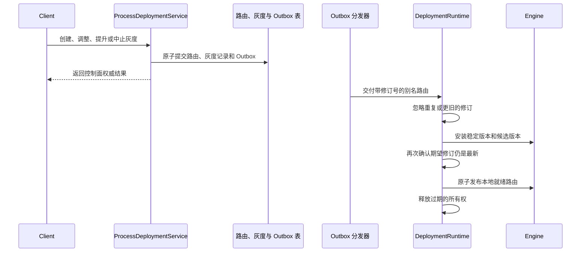

# CompileFlow 版本路由

> 前置阅读：[架构概览](overview.md)与
> [Deploy 协议](../../../compileflow-deploy/docs/PROTOCOL.md)。

CompileFlow 将不可变流程版本、可变别名路由、发布记录和节点本地安装状态分别管理。发布新版本不会自动切换流量，切换流量也不会改写已发布内容。

## 1. 身份与权威状态

已发布流程由 `(namespace, code, version)` 唯一标识：

- `namespace` 是一级逻辑资源作用域，但不作为权限边界。
- `code` 是稳定的流程标识。
- `version` 是不可变且不可复用的版本标识。

直接执行流程定义时使用固定的 `default` 命名空间；不显式接收命名空间的流程引用工厂方法也使用该默认值。
所有显式接收命名空间的 API 都拒绝 `null`、空字符串、首尾空白和非法标识符。仓库实现、协议适配器和快照不会再次解释无效标识。

`cf_process_version` 保存每个版本不可变的流程定义，包括模型类型、原始内容、SHA-256 摘要、元数据、操作人、数据库创建时间和精确调用绑定。
模型类型属于具体版本，因此同一流程编码的不同版本可以使用不同格式。数据行一旦存在即表示版本已发布，不再维护额外的可变准备状态。
精确版本的流程调用可以跨格式，但必须遵守共用的输入输出契约；类路径调用继承调用方的流程格式。发布操作不会编译节点本地运行时，也不会改变流量。

`cf_process_alias` 保存 `(namespace, code, alias)` 对应的当前路由。每条路由包含一个稳定版本，并可在灰度期间增加一个候选版本。
控制面命令和运行时模型统一使用基点（`1..9999`）表示候选流量权重，协议层不会执行隐式单位换算。
`cf_rollout` 与 `cf_rollout_event` 保存灰度操作记录，不参与执行路径查询。

## 2. 运行时快照

`LocalRoutingState` 只持有两类节点本地投影：

| 快照                    | 职责                                               |
| ----------------------- | -------------------------------------------------- |
| `LocalAliasRouteState`  | 本节点已收到的稳定版本、候选版本、别名路由和修订号 |
| `InstalledVersionState` | 本节点已成功安装且可以执行的版本                   |

别名更新使用一个大于零的路由修订号。重复或更旧的修订会被忽略。路由删除记录会保留修订号高水位，避免延迟消息恢复已经删除的路由。

这些投影属于可重建的只读缓存，不是权威数据。默认的 `LocalReadyAliasRouteSource` 只提供本地已经准备就绪的别名路由，
数据库事务仍是控制面状态的权威来源。

## 3. 定向策略与版本选择

别名路由可以显式绑定一个具名 `ProcessAliasTargetingPolicy`。该策略接收当前稳定版本、候选版本、不可变路由参数和有界请求输入，
只能选择 `STABLE`、`CANDIDATE`，或返回空结果进入标准百分比分桶：

```java
public interface ProcessAliasTargetingPolicy {
    String name();
    Optional<ProcessAliasTarget> target(ProcessAliasTargetingContext context);
}
```

上下文不提供候选版本权重，由引擎将选择结果映射为路由允许的不可变版本。因此自定义策略既不能改变百分比分桶规则，也不能构造任意版本。
百分比分桶由协议固定，不提供对应的公共 SPI。

每个引擎只允许配置一个 `ProcessAliasRouteSource`，用于提供不可变且本地就绪的 `ProcessAliasRoute`。路由源必须显式配置，
不会从插件中自动聚合，也不支持多数据源或回退链。默认实现读取 `LocalAliasRouteState`；在嵌入式部署中，首次遇到某个别名时可以同步收敛一次。

核心引擎的 `AliasAdmission` 读取一次路由源并调用 `AliasTargetSelector`：先执行路由指定的具名策略；策略返回空结果时，
再调用 `DeterministicAliasSelector`。选择结果中的版本、目标和修订号会跨格式传递。流程代码运行前，引擎会保留选中的根流程运行时。
只有在路由交接期间无法取得精确运行时时，运行时提供程序才会重新读取路由，并再执行一次完整准入。准入成功后，即使收到新的路由修订，
本次调用仍使用已经选定的版本。固定百分比选择器遵循以下规则：

1. 没有候选版本时返回 `STABLE`；存在候选版本时，执行准入必须提供有效的分组键。
2. 将 `CFROUTE1`、命名空间、流程编码、别名、候选版本和路由键编码为带长度前缀的 UTF-8 字段。
3. 计算 SHA-256，将前 64 bit 解释为无符号数并对 10,000 取模。
4. 结果小于 `candidateWeightBps` 时选择 `CANDIDATE`，否则选择 `STABLE`。

哈希输入包含候选版本，因此新的灰度发布会重新划分流量。同一输入在线程、节点和应用重启后都得到相同结果；不会在单次请求中随机降级。

已发布别名没有可用路由时，请求直接失败。路由指定的策略在节点上不可用时，该路由不能进入本地就绪状态；路由源异常同样会使调用失败。
已注册策略发生运行时异常（包括返回 `null`）时选择稳定版本，并以 `TARGETING_ERROR` 记录原因，不会悄悄转入标准百分比分桶。
有限的路由交接重试只评估更新后的完整路由，运行时不会猜测版本。

每次选择只会产生四种原因：`STABLE_ONLY`、`TARGETING`、`SPLIT`、`TARGETING_ERROR`。诊断信息可以包含所配置的策略名称，
但不能包含请求属性或策略参数值。Durable 启动 Run 时会记录选择原因、可选策略名称和精确版本；原始求值上下文不属于恢复状态。

可选的路由键与自定义策略属性通过 `ProcessExecutionOptions` 提供，不会混入流程变量。未显式提供路由键时，系统直接使用执行实例标识
（occurrence identity）作为路由键：同步调用使用本次调用 ID，持久化异步调用使用其持久化调用 ID，Durable 使用 Process Run ID。
因此，同一次执行在不同节点或应用重启后仍会得到一致的灰度选择：

```java
ProcessExecutionOptions options = ProcessExecutionOptions.builder()
        .aliasRouting(new AliasRoutingOptions("customer-7", Map.of("region", "cn-east")))
        .build();

engine.execute(
        ProcessRef.alias("default", "order.process", "production"),
        variables,
        options).orElseThrow();
```

`routingKey` 是不透明值：CompileFlow 不会去除其首尾空白、解析其内容、写入日志、持久化、返回给调用方或放入流程变量。
路由属性仅用于本次请求，属于不可信且可能敏感的策略输入，同样不会记录或持久化。自定义属性 Map 不能与
`alias`、`version`、`namespace`、`processCode`、`routingKey` 等一级字段重名，也不能使用 `__cf_` 保留命名空间。
路由键最长 512 个字符；属性最多 32 项；属性名最长 128 个字符；属性值最长 2,048 个字符；全部路由输入的 UTF-8 编码总量不超过 32 KiB。

运行时只通过以下规则解析版本：

1. `ProcessRef.Version` 使用显式请求的不可变版本。
2. `ProcessRef.Alias` 通过已配置的 `ProcessAliasRouteSource`、可选的路由定向策略和固定百分比分桶解析。
3. 所有 `ProcessDefinition` 变体都按显式提供的流程定义执行，不经过别名路由。

系统不会查询所谓的活动版本，也不会回退到上一版本或猜测最新版本。使用 `DeploymentRuntime` 时，所选版本还必须存在于
`InstalledVersionState`，否则执行请求直接失败。

## 4. 控制面操作

`ProcessDeploymentService` 提供以下操作：

| 操作                                            | 效果                                                             |
| ----------------------------------------------- | ---------------------------------------------------------------- |
| `publish(PublishProcessVersionCommand)`         | 校验并持久化一份内容不可变的流程定义；不安装运行时，也不切换流量 |
| `createRollout(CreateRolloutCommand)`           | 原子创建灰度记录、修改路由并写入 Outbox                          |
| `updateCanaryWeight(UpdateCanaryWeightCommand)` | 校验灰度记录和别名修订号后，修改以基点表示的候选流量权重         |
| `promoteRollout(PromoteRolloutCommand)`         | 将候选版本提升为唯一稳定版本并完成灰度发布                       |
| `abortRollout(AbortRolloutCommand)`             | 恢复灰度开始时保存的稳定路由，并将本次灰度标记为已中止           |
| `rollbackRollout(RollbackRolloutCommand)`       | 创建一次全量发布，恢复某次已完成灰度所保存的原稳定路由           |

`ALL_AT_ONCE` 创建后立即进入完成状态；`CANARY` 创建状态为 `IN_PROGRESS` 的灰度记录，运行时需要同时准备稳定版本和候选版本。

每次创建灰度都必须提供操作人、操作类型、限定作用域的幂等键和预期别名修订号；修订号为零表示别名必须尚不存在。
幂等键的作用域包含命名空间、流程、别名和操作类型，请求指纹覆盖完整的语义请求。修改灰度时使用灰度修订号，
并校验目标别名仍与预期一致。前置条件过期时操作失败，不会覆盖其他并发操作。

只有对应别名仍处于预期修订号的已完成灰度记录可以作为回滚来源。回滚会创建新的 `ALL_AT_ONCE` 记录，目标指向来源记录保存的原稳定版本，
已有记录保持不变。中止正在进行的灰度则会结束本次灰度，并恢复开始时保存的稳定路由。

## 5. 灰度示例

```java
ProcessRef.Version version =
        ProcessRef.version("default", "order.process", "v2.0.0");
ProcessDefinition.Inline definition =
        ProcessDefinition.inline(ProcessModelType.TBBPM, "order.process", xml);

deploymentService.publish(new PublishProcessVersionCommand(
        version, definition, "alice", metadata));

ProcessRollout canary = deploymentService.createRollout(CreateRolloutCommand.canary(
        "release-order-v2",
        ProcessRef.alias("default", "order.process", "production"),
        ProcessRef.version("default", "order.process", "v2.0.0"),
        currentAliasRevision,
        1_000,
        "alice",
        "ticket-4821"));

canary = deploymentService.updateCanaryWeight(new UpdateCanaryWeightCommand(
        canary.getId(), 5_000, canary.getRevision(), "alice"));

canary = deploymentService.promoteRollout(new PromoteRolloutCommand(
        canary.getId(), canary.getRevision(), "alice"));
```

灰度指标退化时中止：

```java
deploymentService.abortRollout(new AbortRolloutCommand(
        canary.getId(), canary.getRevision(), "alice", "error rate exceeded policy"));
```

## 6. 事务提交与运行时收敛



控制面命令成功只表示权威事务已经提交，不代表所有节点都已收敛。路由消息采用至少一次交付；传输状态不一致时，协调任务会根据当前权威状态重新发布。

节点会先记录新的期望路由，但在安装所有必要运行时并重新确认期望修订号之前，执行组件仍使用原来的本地就绪路由。
没有旧路由时，请求直接失败。安装失败会保留旧路由，并通过运行时诊断信息暴露；节点不会发布只准备了部分版本的路由。
Outbox 状态、带路由信息的执行日志和安装失败信息可以分别反映控制面提交与节点收敛进度。

发布本地就绪状态只会让新请求使用新路由，不会中断已经准入的工作。每次按版本调用都会先确定精确的根流程，再在业务代码执行前准备完整的静态调用图。
每个已发布流程调用都在父流程定义中声明精确的子流程 `version`，并只继承父流程的命名空间；别名仅用于根流程路由。
准备完成的调用图持有本次执行需要的全部精确运行时，因此之后的别名变化或缓存淘汰不会改变已经准入的调用。
精确子流程缺失或未就绪时返回 `CF_EXEC_012`；权威状态不一致、身份不一致或调用成环会在首个 Action 运行前返回 `CF_EXEC_014`。

## 7. 可观测性与灰度健康

Alias 路由执行会记录：

- 命名空间与流程编码；
- 请求版本与实际版本；
- 路由来源；
- 路由别名；
- 路由修订号。

事件在异步监听器分发前冻结为不可变快照。Server 只持久化这些已知路由字段，不保存任意应用元数据。

本地灰度健康分析只使用命名空间、流程编码和路由别名匹配日志，且日志时间不得早于灰度创建时间。缺少路由信息的执行不会纳入评估。
接口只计算绝对错误率和延迟阈值，不会自动修改流量；提升或中止仍由操作人显式执行。

## 8. 运维检查

- 保持 Alias 名称稳定。Workbench 建议 `dev`、`staging` 和 `production`，但接受任意合法 Process Alias。
- 需要同一业务身份始终落入同一灰度分组时，提供稳定的路由键。
- 路由修订号冲突后，先读取当前状态，再显式重试。
- 分别监控控制面提交和运行时收敛。
- 通过 `DeploymentRuntime.snapshot()` 检查需要安装、安装中、已部署和等待重试的版本。
- 验证灰度结果时，按路由别名和修订号检索执行日志。
- 处理故障时不要修改已发布版本，也不要绕过灰度记录。

## 9. 实现引用

- [`AliasTargeting`](../../../compileflow-api/src/main/java/com/alibaba/compileflow/engine/spi/routing/AliasTargeting.java)
- [`ProcessAliasTargetingPolicy`](../../../compileflow-api/src/main/java/com/alibaba/compileflow/engine/spi/routing/ProcessAliasTargetingPolicy.java)
- [`ProcessAliasTargetingContext`](../../../compileflow-api/src/main/java/com/alibaba/compileflow/engine/spi/routing/ProcessAliasTargetingContext.java)
- [`ProcessAliasRouteSource`](../../../compileflow-api/src/main/java/com/alibaba/compileflow/engine/spi/routing/ProcessAliasRouteSource.java)
- [`ProcessAliasRoute`](../../../compileflow-api/src/main/java/com/alibaba/compileflow/engine/spi/routing/ProcessAliasRoute.java)
- [`AliasTargetSelector`](../../../compileflow-core/src/main/java/com/alibaba/compileflow/engine/core/routing/AliasTargetSelector.java)
- [`DeterministicAliasSelector`](../../../compileflow-core/src/main/java/com/alibaba/compileflow/engine/core/routing/DeterministicAliasSelector.java)
- [`AliasAdmission`](../../../compileflow-core/src/main/java/com/alibaba/compileflow/engine/core/routing/AliasAdmission.java)
- [`AliasSelection`](../../../compileflow-core/src/main/java/com/alibaba/compileflow/engine/core/routing/AliasSelection.java)
- [`LocalAliasRouteState`](../../../compileflow-core/src/main/java/com/alibaba/compileflow/engine/core/routing/LocalAliasRouteState.java)
- [`LocalReadyAliasRouteSource`](../../../compileflow-core/src/main/java/com/alibaba/compileflow/engine/core/routing/LocalReadyAliasRouteSource.java)
- [`ProcessRuntimeResolver`](../../../compileflow-core/src/main/java/com/alibaba/compileflow/engine/core/runtime/resolution/ProcessRuntimeResolver.java)
- [`ProcessDeploymentService`](../../../compileflow-deploy/compileflow-deploy-api/src/main/java/com/alibaba/compileflow/deploy/api/ProcessDeploymentService.java)
- [`DeploymentRuntime`](../../../compileflow-deploy/compileflow-deploy-runtime/src/main/java/com/alibaba/compileflow/deploy/runtime/DeploymentRuntime.java)
- [`ProjectionStoreRoutingStateSubscriber`](../../../compileflow-deploy/compileflow-deploy-runtime/src/main/java/com/alibaba/compileflow/deploy/runtime/routing/ProjectionStoreRoutingStateSubscriber.java)
- [`VersionRuntimeManager`](../../../compileflow-deploy/compileflow-deploy-runtime/src/main/java/com/alibaba/compileflow/deploy/runtime/version/VersionRuntimeManager.java)
