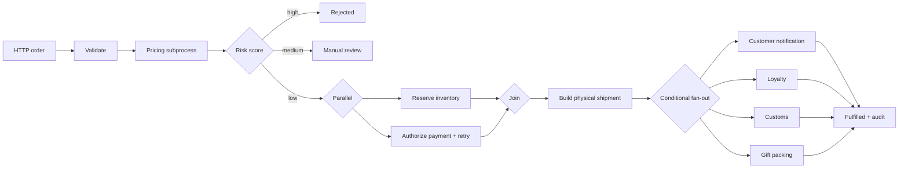

# CompileFlow Order Fulfillment Example

This runnable Spring Boot service uses CompileFlow to orchestrate order validation, pricing, risk assessment, inventory,
payment, shipment, and notifications. It demonstrates a realistic HTTP workflow rather than a single calculation.

## What It Demonstrates

| Capability | Use in this example |
|---|---|
| Spring Boot auto-configuration | Injects one `ProcessEngine` and Spring Bean actions |
| Least-privilege component access | Exposes only `orderOperations` through `allowed-beans` |
| Strict preflight | Validates the main process and pricing subprocess at startup |
| Structured business data | Passes `OrderRequest` and `OrderItem` as typed process variables |
| Process Call | Invokes a separately defined pricing process through `bpmCall` |
| Java Script | Calculates the member discount, payable amount, and business status |
| Exclusive gateway | Routes low-, medium-, and high-risk orders |
| Parallel gateway | Reserves inventory and authorizes payment concurrently, then joins |
| Invocation Policy | Applies a timeout, exponential backoff, and up to three payment attempts |
| Foreach and Continue | Iterates over line items and skips shipment for digital products |
| Inclusive gateway | Runs applicable loyalty, customs, gift, and notification actions |
| Invocation attribution | Maps `X-Invocation-Id` to `ProcessExecutionOptions.invocationId` |
| Controlled response | Maps process variables to a stable `OrderResponse` |
| Failure contract | Maps an exhausted `ProcessError` to a stable HTTP 422 response |
| Actuator | Exposes health, info, and metrics endpoints |

Persistent Timer, Wait, Trigger, Outbox, and crash-recovery behavior belongs to the Durable execution model. See the
adjacent [`spring-boot-durable-postgres`](../spring-boot-durable-postgres/README.md) example. Keeping the examples
separate makes the synchronous Engine and Durable Run semantics explicit.

## Workflow



## Run

Install the required modules from the repository root, then start the example:

```bash
./mvnw install -pl compileflow-spring-boot-starter -am -DskipTests
cd examples/spring-boot-order-fulfillment
../../mvnw spring-boot:run
```

Send an order that succeeds after one transient payment failure:

```bash
curl -sS http://localhost:8080/api/orders/fulfill \
  -H 'Content-Type: application/json' \
  -H 'X-Invocation-Id: demo-order-1001' \
  -d '{
    "orderId": "order-1001",
    "customerTier": "PLATINUM",
    "destinationCountry": "US",
    "items": [
      {"sku": "SKU-PHYSICAL", "quantity": 2, "digital": false},
      {"sku": "DIGITAL-LICENSE", "quantity": 1, "digital": true}
    ],
    "subtotalCents": 12000,
    "paymentFailUntilAttempt": 2,
    "fraudSignal": false,
    "giftOrder": true
  }'
```

The response includes:

```json
{
  "status": "FULFILLED",
  "riskScore": 10,
  "discountCents": 2400,
  "payableCents": 9600,
  "shipmentPlan": "SKU-PHYSICALx2",
  "loyaltyEvent": "LOYALTY:PLATINUM:order-1001",
  "customsDocument": "CUSTOMS:US:order-1001",
  "giftPacking": "GIFT_PACK:order-1001"
}
```

Set `subtotalCents` to `100000` to reach `REVIEW_REQUIRED`, or set `fraudSignal` to `true` to reach `REJECTED`.

## Verify

```bash
./mvnw test \
  -pl examples/spring-boot-order-fulfillment \
  -Pexamples -am
```

The tests cover successful fulfillment, transient payment recovery, exhausted payment retries, manual review, risk
rejection, and the HTTP JSON contract.
