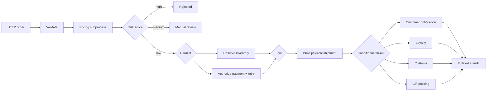

# CompileFlow Order Fulfillment Example

This Spring Boot service uses CompileFlow to coordinate order validation, pricing, risk assessment, inventory, payment,
shipment, and notifications through a REST endpoint. It listens only on `127.0.0.1` and does not implement
authentication or authorization, so do not expose it on a shared network.

## What it demonstrates

| Capability                       | Use in this example                                                                                   |
| -------------------------------- | ----------------------------------------------------------------------------------------------------- |
| Spring Boot auto-configuration   | Injects a `ProcessEngine` and Spring bean actions                                                     |
| Least-privilege component access | Exposes only `orderOperations` through `allowed-beans`                                                |
| Strict preflight                 | Validates the main process and pricing subprocess at startup                                          |
| Structured business data         | Passes `OrderRequest` and `OrderItem` as typed process variables                                      |
| Process call                     | Invokes a separately defined pricing process through `bpmCall`                                        |
| Java script                      | Calculates the member discount, payable amount, and business status                                   |
| Exclusive gateway                | Routes low-, medium-, and high-risk orders                                                            |
| Parallel gateway                 | Reserves inventory and authorizes payment concurrently, then joins                                    |
| Invocation policy                | Retries simulated failures that occur before payment acceptance; the adapter deduplicates by order ID |
| Foreach and Continue             | Iterates over line items and excludes digital products from shipment                                  |
| Inclusive gateway                | Runs applicable loyalty, customs, gift, and notification actions                                      |
| Invocation attribution           | Maps `X-Invocation-Id` to `ProcessExecutionOptions.invocationId`                                      |
| Controlled response              | Maps process variables to a stable `OrderResponse`                                                    |
| Failure contract                 | Maps an exhausted `ProcessError` to a stable HTTP 422 response                                        |
| Actuator                         | Exposes health, info, and metrics endpoints                                                           |

For persistent Timer, Wait, Outbox, and recovery behavior, see the
[`spring-boot-durable-postgresql`](../spring-boot-durable-postgresql/README.md) example.

The simulated payment adapter uses the order ID as its idempotency key. Repeating the same order and amount returns the
original authorization; reusing the order ID with a different amount fails. Retries occur only for failures raised
before payment acceptance. Do not retry a real payment after a timeout or connection loss unless its acceptance status
can be reconciled; use Durable Effect recovery for uncertain outcomes.

## Workflow



## Run

Install the required modules and start the example from the repository root:

```bash
./mvnw install -pl compileflow-spring-boot-starter-tbbpm -am -DskipTests
./mvnw -f examples/spring-boot-order-fulfillment/pom.xml spring-boot:run
```

Send an order that succeeds after one transient payment failure:

```bash
curl -sS http://localhost:8080/api/orders/fulfill \
  -H 'Content-Type: application/json' \
  -H 'X-Invocation-Id: demo-order-1001' \
  -d '{
    "orderId": "order-1001",
    "customerTier": "PLATINUM",
    "destinationCountry": "US",
    "items": [
      {"sku": "SKU-PHYSICAL", "quantity": 2, "digital": false},
      {"sku": "DIGITAL-LICENSE", "quantity": 1, "digital": true}
    ],
    "subtotalCents": 12000,
    "paymentFailUntilAttempt": 2,
    "fraudSignal": false,
    "giftOrder": true
  }'
```

The response includes:

```json
{
    "status": "FULFILLED",
    "riskScore": 10,
    "discountCents": 2400,
    "payableCents": 9600,
    "shipmentPlan": "SKU-PHYSICALx2",
    "loyaltyEvent": "LOYALTY:PLATINUM:order-1001",
    "customsDocument": "CUSTOMS:US:order-1001",
    "giftPacking": "GIFT_PACK:order-1001"
}
```

Set `subtotalCents` to `100000` to reach `REVIEW_REQUIRED`, or set `fraudSignal` to `true` to reach `REJECTED`.

## Verify

```bash
./mvnw test \
  -pl examples/spring-boot-order-fulfillment \
  -Pexamples -am
```

The tests cover successful fulfillment, transient payment recovery, exhausted payment retries, manual review, risk
rejection, and the HTTP JSON contract.
